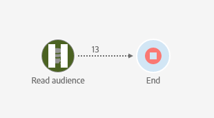
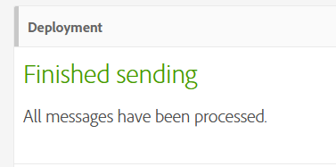
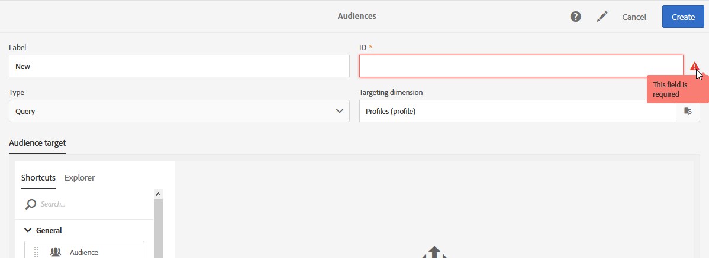
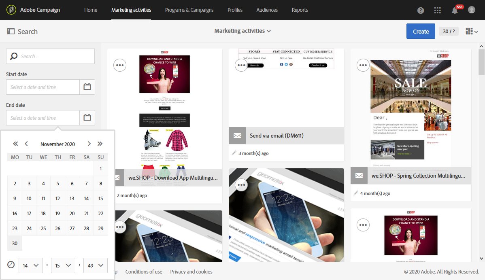
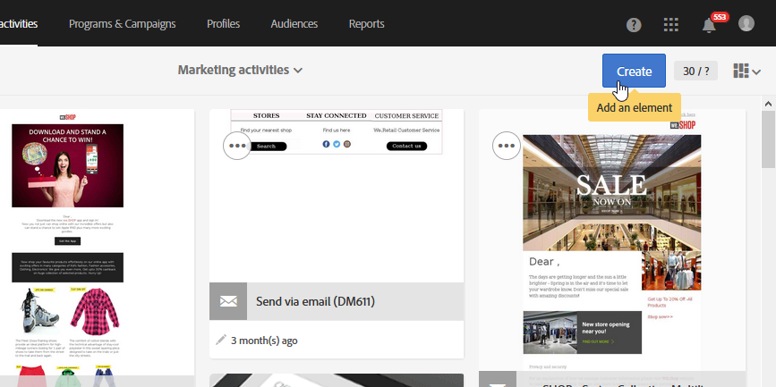
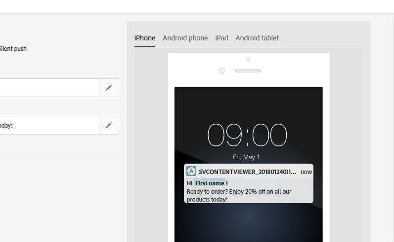
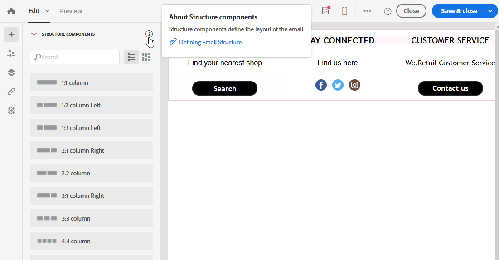

# Accessibility in Adobe Campaign Standard {#accessibility-acs}

Learn about accessibility support in Adobe Campaign Standard Workspace.

Accessibility refers to making products usable for people with visual, auditory, cognitive, motor, and other disabilities. Examples of accessibility features for software products include screen reader support, text equivalents for graphics, keyboard shortcuts, change of display colors to high contrast, and so on.

Adobe Campaign Standard provides some tools that make it accessible to use such as contrast, keyboard navigation, contextual help and responsive resize.

## Accessibility features {#accessibility-features}

### Contrast {#contrast}

Adobe Campaign Standard user interface strives to provide enough contrast in the application to ensure an accessible viewing experience for users with low vision or color deficiencies.

* Workflows' pause and cancel icons have been updated to improve the contrast between background and foreground.

    

* The text displayed when a delivery is successful contained large green text with an insufficient contrast between the background and the foreground. The contrast has been updated with a minimum ratio of 3:1.

    

* Adobe Campaign Standard ensures that color, shape or location are not the sole methods used to communicate information or hierarchy.

### User interface {#user-interface}

Adobe Campaign Standard user interface makes it easier for users to see and hear content including separating foreground from background.

* When the user leaves a required ID field blank, a graphic indicates visually which field is in error with an error message text.

    

* Content that appears on hover or focus can be dismissed by the user and does not obscure other content.

    

* Alternative texts for image buttons have been added and can be read instead of viewing an illustration.

    

* Data table headers cells are not left empty in the corner of table when using lists.

### Create responsive resize for multiple devices {#resize-devices}

When designing for multiple devices and platforms, it's important to create a seamless experience for screen sizes across mobile and desktop resolutions.

Adobe Campaign Standard allows you to design and test emails and push notifications on different devices such as: iPhone, Android devices, iPad, Android tablet and desktop.

## Contextual help {#contextual-help}

>[!NOTE]
>
> The contextual help is only available when using the email designer.

The contextual help can help you better understand the different requested fields and features available. It also guides you through product documentation to learn more information on the selected feature.

When designing an email, you can hover your cursor over the information button. A tooltip will appear providing features descriptions and links to the product documentation.

## Support for screen magnifiers {#screen-magnifiers}

A screen reader reads text that appears on the computer screen. It also reads non-textual information, such as button labels or image descriptions in the application, provided in accessibility tags or attributes.

In Adobe Campaign Standard, content and functionality are still available even if the user overrides text spacing properties.

## Work in your preferred language {#languages}

Adobe Campaign Standard is available in different languages: English, French and German.

Please note that language is set up at the installation, and cannot be changed afterwards.

## Keyboard shortcuts {#shortcuts}

### Homepage {#homepage-shortcuts}

| Shortcut  |  Action |
|:-:|:-:|
| Tab | Navigate through individual elements of the user interface|
| Enter or Space | Activate the selected item |

### Email designer {#email-designer-shortcuts}

| Shortcut  |  Action |
|:-:|:-:|
| CTRL + Z  | Undo  |
| CTRL + Y  |  Redo |

### Dynamic reports {#report-shortcuts}

| Shortcut  |  Action |
|:-:|:-:|
| CTRL + O | Open project |
| CTRL + S  |  Save |
| Shift + CTRL + S | Save as |
| Alt + R  | Refresh project |
| Shift + CTRL + V | Download CSV |
| Alt + P | Print |
| CTRL + Z | Undo |
|  CTRL + Shift + Z | Redo |
| Alt + B | New blank panel |
| Alt + A | New freeform |
| Alt + 1 | New freeform table |
| Alt + 2 | New line |
| Alt + 3 | New bar |
| Alt + S | Send report now |
| Shift + Alt + S | Send report on schedule |
| Shift = Alt + L | Scheduled reports |

## Further Reading {#further-reading}

Adobe Campaign Standard strives to provide an ever-increasing degree of accessibility, making the product easy to use for everyone.

We encourage you to use the [Adobe Accessibility Feedback Form](https://www.adobe.com/accessibility/feedback.html) to send us improvement suggestions and accessibility issues that you run into.

You can also refer to [Adobe Campaign Standard release notes](https://experienceleague.adobe.com/docs/campaign-standard/using/release-notes/release-notes.html?lang=en#release-notes) to follow the latest improvements and features.