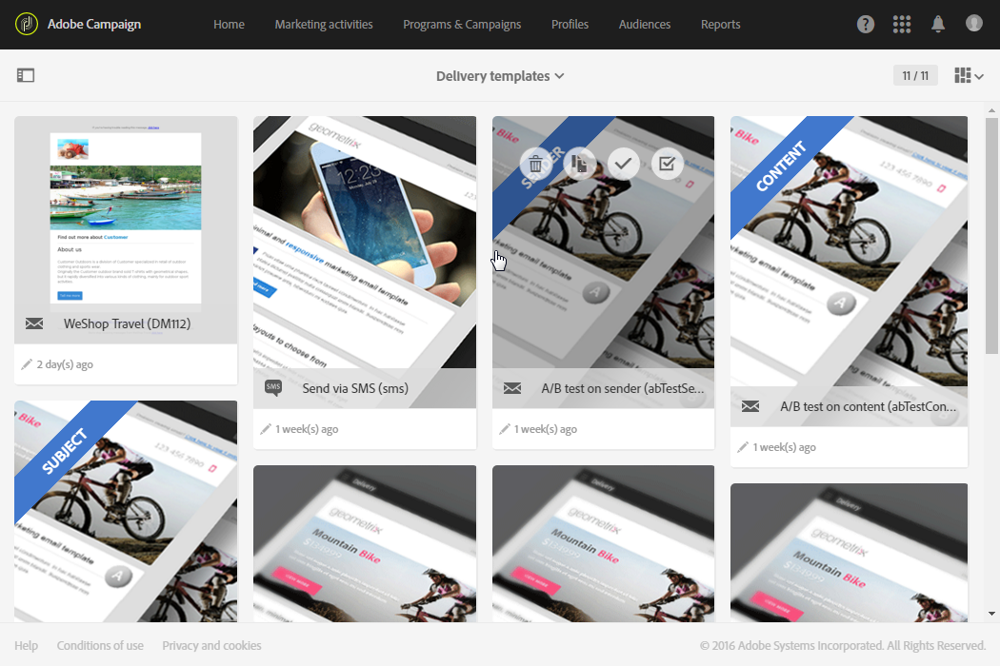
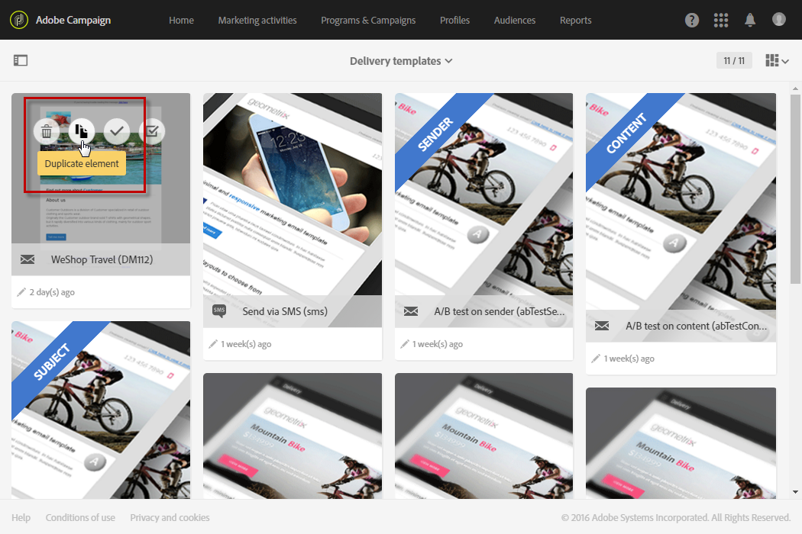
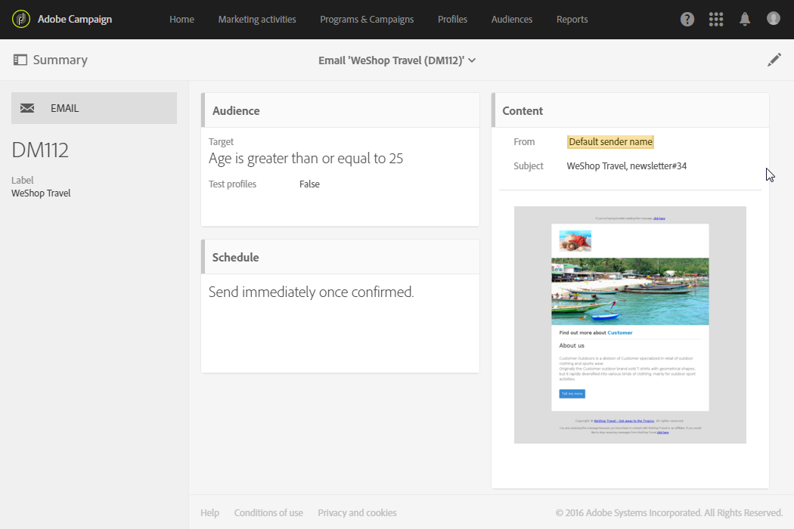

# Creating a new template{#creating-a-new-template}

Creating a new template

Message templates can be managed by the functional administrator of the platform, under the **[!UICONTROL Resources > Templates]** menu. Out-of-the-box templates cannot be modified or deleted. To create a new template, you must duplicate an existing one.

1. Select an existing template. In our example, we have chosen a **[!UICONTROL Delivery template]** .

   

1. Hover over it with the mouse, then select the **[!UICONTROL Duplicate element]** option.

   

1. Configure any settings you want, just like you would do when [creating a new marketing activity](../../start/using/marketing-activities.md#creating-a-marketing-activity) from scratch.

   

Created templates can then be selected by standard user in the first screen of the wizard while creating a marketing activity.

**Related topics:**

* [Branding](../../administration/using/branding.md)
* [Design content](../../designing/using/about-email-content-design.md)

