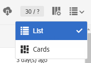
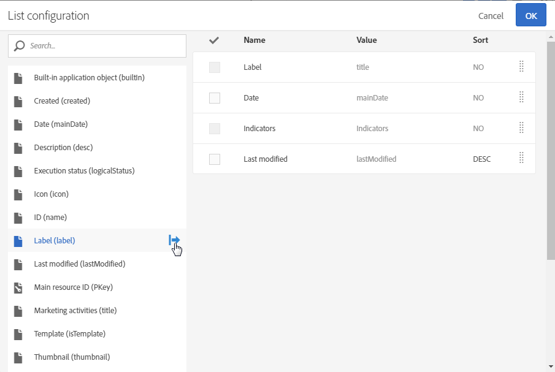

# Customizing lists

Customizing lists

**List** screens allow you to display elements of one or several given resources.

Adobe Campaign has two types of lists:

* A "homogeneous" list, which is when it contains a single type of resource. For example, the profile list only contains profiles.
* A "heterogeneous" list, which is when it contains several types of resources. For example, the list of marketing activities contains landing pages, workflows, emails, SMS, etc.

The lists are displayed in columns. Each column can be sorted in ascending or descending order one at a time.

The elements in a list have a checkbox that allows you to select them. By selecting one or several elements, you can carry out several actions, such as editing, duplicating and deleting these elements.

When hovering over an element in the list, **quick actions**. These actions allow the user to take various actions on the element that is hovered over, such as edit, select, delete, or show details. 

You can also configure whether columns in a list are to be displayed or not. To add or remove columns:

1. Make sure that the screen is in **List** mode.

   

1. Go to the list configuration window by selecting the  

   button in the action bar.

   

1. Add the columns that you want to include in your list. To do this, select a column from the left-hand side of the window, then use the  

   button from the action bar to add a column.

   The selectable columns correspond to the list resource.

   For each column added, specify whether you want to apply sorting by default:

    * **NO**: No sort on the column
    * **ASC**: Applies an ascending (rising) sort on the column
    * **DESC**: Applies a descending (declining) sort on the column.

1. Delete the columns that you do not want to be displayed by checking the boxes corresponding to the columns to delete. Then, use the  

   button from the action bar to confirm deleting them.
1. Once your list contains the correct columns, you can change the order in which they are displayed in the list by checking the columns that you want to move. Then, use the   and  

   arrows.
1. Confirm your list configuration by selecting **OK**.

Your list is now displayed as you have configured it.
