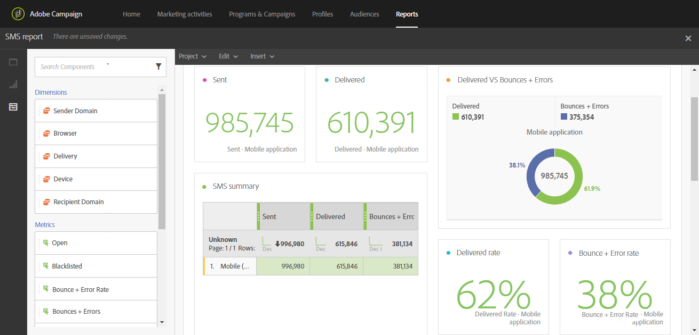

# Design & send messages

<table>
<tr>
    <td valign="top">
        
    </td>
    <td valign="top">
        
    </td>
    <td valign="top">
        
    </td>
    <td valign="top">
        
    </td>
    <td valign="top">
        
    </td>
</tr>
<tr>
<td>Design your deliveries</td>
<td>Create deliveries</td>
<td>Personalize and make your deliveries dynamic</td>
<td>Track and monitor your deliveries</td>
<td>Setup reports</td>
</tr>
</table>

## Design your deliveries

Lorem ipsum dolor sit amet, consectetur adipiscing elit. Vestibulum placerat mauris libero, non congue sapien rhoncus id. Integer luctus blandit ligula. Nulla quis vehicula augue, a lacinia risus. Nunc pharetra fringilla enim eu suscipit. Mauris consectetur maximus euismod. Cras et vehicula nulla. Aenean tellus quam, tristique quis risus consectetur, pulvinar elementum dui.

**Read more**

* xxxx
* xxxx

## Create deliveries

Lorem ipsum dolor sit amet, consectetur adipiscing elit. Vestibulum placerat mauris libero, non congue sapien rhoncus id. Integer luctus blandit ligula. Nulla quis vehicula augue, a lacinia risus. Nunc pharetra fringilla enim eu suscipit. Mauris consectetur maximus euismod. Cras et vehicula nulla. Aenean tellus quam, tristique quis risus consectetur, pulvinar elementum dui.

**Read more**

* xxxx
* xxxx

## Personalize and make your deliveries dynamic

Get your clients' attention and improve your response rate by using content and headers that are personalized according to their profiles, their preferences, and their activity. All of your client information is centralized in Adobe Campaign and you can offer messages containing adapted content, via different channels.

Personalized messages are key to send relevant content, offer personalized experiences and increase open and conversion rates. Cross-channel messages delivered by Adobe Campaign can be personalized in several different ways. These ways can be combined with criteria depending on the profiles. You can:

* Insert [dynamic personalization fields](../../designing/using/personalization.md#inserting-a-personalization-field) in your messages
* Insert [predefined personalization blocks](../../designing/using/personalization.md#adding-a-content-block)
* [Personalize the sender](../../designing/using/subject-line.md) of an email or a SMS
* [Personalize the subject line](../../designing/using/subject-line.md) of an email, or use [Predictive subject line](../../designing/using/subject-line.md#subject-line) capabilities to optimize it
* Create [conditional content in an email](../../designing/using/personalization.md#defining-dynamic-content-in-an-email) or [in a landing page](../../channels/using/designing-a-landing-page.md#defining-dynamic-content-in-a-landing-page)
* Insert [Dynamic text](../../channels/using/defining-dynamic-text.md) in a SMS message or a Push notification

**Read more**

* Discover email personalization through a [end-to-end sample](../../designing/using/personalization.md#example-email-personalization)
* [Personalizing URLs](../../designing/using/personalization.md#personalizing-urls)
* [Settin up personalization of an image](../../designing/using/personalization.md#personalizing-an-image-source)

## Track and monitor your deliveries

In addition to powerful, out-of-the box reporting templates, Adobe Campaign lets you create custom reports on a delivery, campaign, user, or segment level. Track your messages and understand your clients' behavior by progressively enriching their profile data. Reporting and analysis tools allow you to capitalize on each new campaign, better target your marketing actions, and optimize their impact and return on investment.

The graphical interface provides fast, easy access to the main indicators and delivery statistics.

The campaign reporting user interface facilitates the creation of dynamic reports. You can use drag-and-drop variables to customize your reports and to analyze the success of your campaigns. Depending on the complexity of your queries and calculations, the data can be aggregated into a list view or accessed in a format that makes it easy to generate marketing analytics reports.

With Adobe Campaign, you can monitor and track each delivery individually. The message dashboard displays dedicated logs to follow-up processes, rules and identify possible errors and warnings.

**Read more**

* [Accessing reports](../../reporting/using/about-dynamic-reports.md)
* [Monitoring a delivery](../../sending/using/monitoring-a-delivery.md)
* [Tracking messages](../../sending/using/tracking-messages.md)

## Setup reports

Lorem ipsum dolor sit amet, consectetur adipiscing elit. Vestibulum placerat mauris libero, non congue sapien rhoncus id. Integer luctus blandit ligula. Nulla quis vehicula augue, a lacinia risus. Nunc pharetra fringilla enim eu suscipit. Mauris consectetur maximus euismod. Cras et vehicula nulla. Aenean tellus quam, tristique quis risus consectetur, pulvinar elementum dui.

**Read more**

* xxxx
* xxxx
