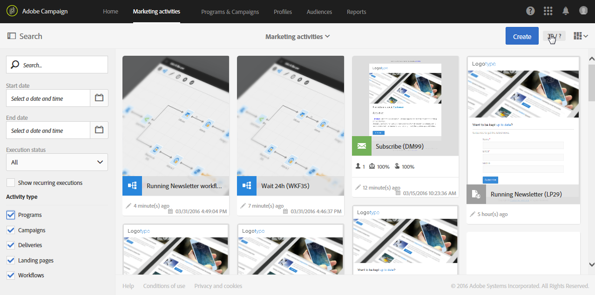
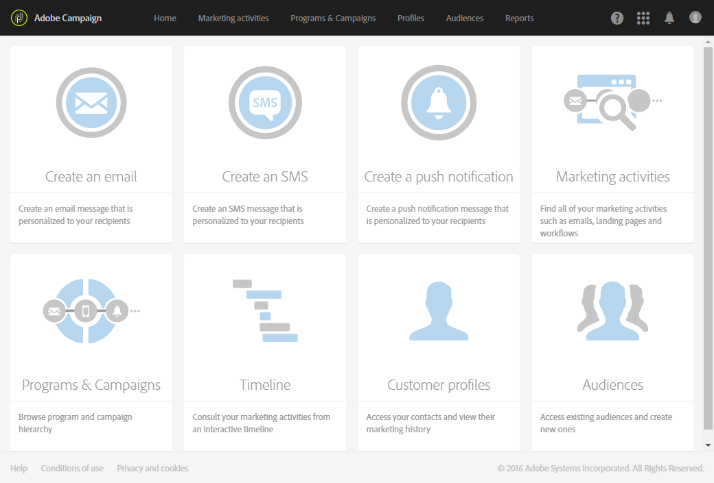
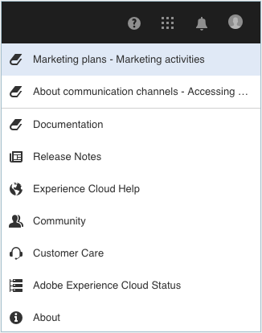
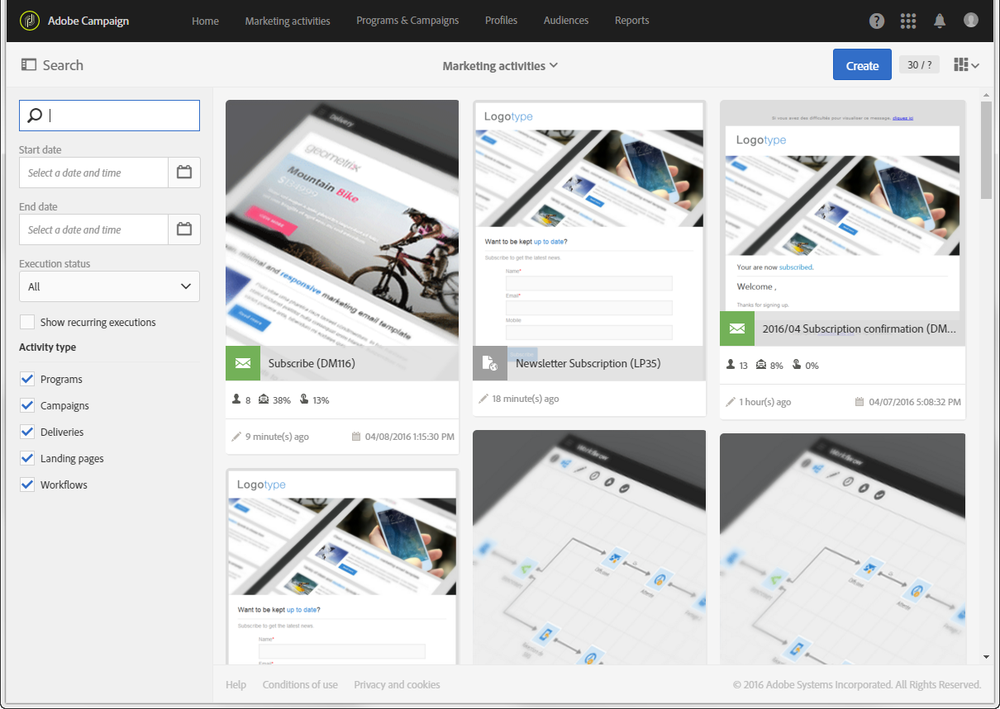
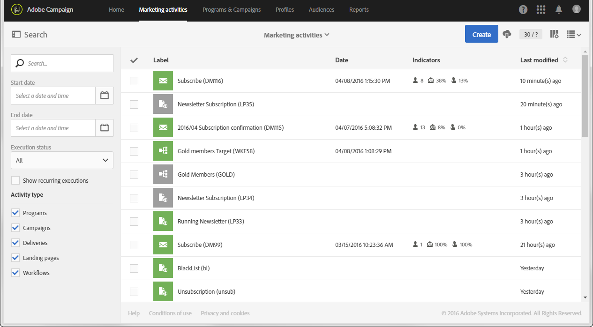
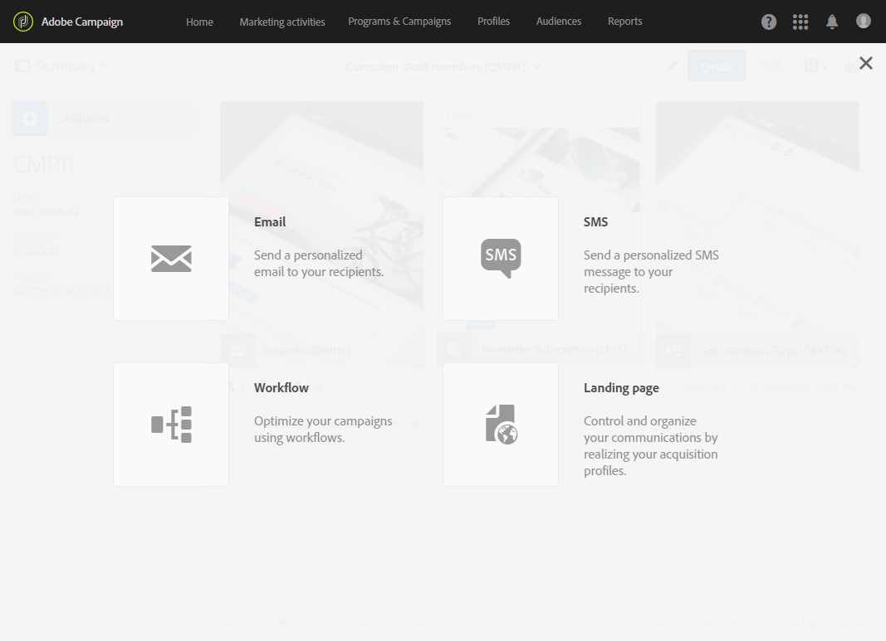
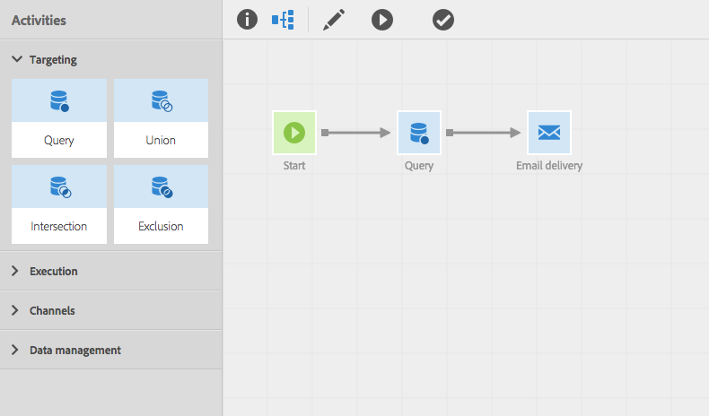

# Interface description

Interface description

Adobe Campaign, lets you navigate through different menus and screen to manage your campaigns.

All Adobe Campaign screens are made up of the following elements:

* A top bar for navigation
* An advanced menu to access specific functionalities and configurations
* A main zone to work on certain elements
* A lateral panel, according to the context, to filter or search within the elements displayed.

 

## Home page

The home page is made up of multiple cards that give you quick access to the main Adobe Campaign functionalities.

* The **Create an email** card takes you to the email creation assistant. This assistant lets you choose an email type, select your message recipients and define your content. Refer to the [Creating an email](../../channels/using/creating-an-email.md) section.
* The **Create an SMS** card takes you to the SMS creation assistant. This assistant lets you choose an SMS type, select your message recipients and define your content. Refer to the [Creating an SMS](../../channels/using/creating-an-sms-message.md) section.
* The **Create a Direct mail** card takes you to the direct mail creation assistant. Refer to the [Creating a direct mail](../../channels/using/creating-the-direct-mail.md) section.
* The **Create a push notification** card takes you to the notification creation assistant. This assistant lets you choose a push notification type, select your message recipients and define your content. Refer to the [Creating a push notification](../../channels/using/creating-and-sending-a-push-notification.md) section.
* The **Marketing activities** card takes you to the complete list of all the activities, programs, and campaigns, particularly emails, SMS, workflows, and landing pages. From here you can then filter the elements by searching by name, date, status or activity type. For more on this, refer to the [Marketing activity list](../../start/using/marketing-activities.md#about-marketing-activities) section.
* The **Programs & campaigns** card takes you to the list of programs in which you can display, create, and manage your campaigns. Refer to [Program list](../../start/using/programs-and-campaigns.md#about-plans--programs-and-campaigns).
* The **Timeline** card takes you directly to an interactive timeline of your marketing activities, in which you can consult the ongoing programs and their content. Refer to [Timeline](../../start/using/timeline.md).
* The **Customer profiles** card takes you directly to the list of profiles. From here you can consult the events concerning each of the profiles in your list. Refer to [Managing profiles](../../audiences/using/about-profiles.md).
* The **Audiences** card takes you directly to the list of audiences. From here you can create new sets of individuals. Refer to [Managing audiences](../../audiences/using/about-audiences.md).

## Top bar

The top bar is visible on every screen and allows you to navigate through Adobe Campaign functionalities as well as access the Adobe profile connected, notifications, other Adobe Experience Cloud solutions and configurations, and the documentation.

The navigation principles are:

* The **Adobe Campaign** logo in the top left-hand corner of the page gives you access to the advanced functions. The menus offered depend on the permissions allocated to the user connected.

  The advanced menu is presented in the [Advanced menu](../../start/using/interface-description.md#advanced-menu) section.

* The **Home** link allows you to display the Adobe Campaign home page.
* The **Marketing activities**, **Programs & Campaigns**, **Profiles**, **Audiences** and **Reports** links let you access the views linked to these functionalities. 
* The **Help** button gives access to the product documentation and contextual help, release notes, version numbers, legal notices, as well as the links to the Adobe Experience Cloud community and customer care.

  

* The **Select solution** icon lets you switch to another Adobe Experience Cloud solution as well as to the settings linked to the account being used.
* The **Notifications** icon displays the latest alerts or information for the user connected.
* The **User** icon allows you to display information linked to the current user. It gives access to the **Sign out** button.

## Advanced menu

The advanced menu is displayed by clicking the **Adobe Campaign** icon, in the top left corner of each screen. The advanced menu may vary depending your contract and user permissions.

This menu allows you to navigate to specific functionalities and settings.

### Marketing plans

The **Marketing plans** icon gives you access the following functionalities:

* **Marketing activities** - for more on this, refer to the [Marketing activity list](../../start/using/marketing-activities.md#about-marketing-activities) section.
* **Programs & Campaigns** - for more on this, refer to the [Program list](../../start/using/programs-and-campaigns.md#about-plans--programs-and-campaigns) section.
* **Timeline** - for more on this, refer to the [Timeline](../../start/using/timeline.md) section.
* **Transactional messages**, which contains the sub-menus **Deliveries** and **Event configuration** - for more on this, refer to the [Transactional messaging](../../channels/using/about-transactional-messaging.md) section.

### Profiles &amp; audiences

The **Profiles & audiences** icon gives you access to the following functionalities:

* **Profiles** - for more on this, refer to the [Managing profiles](../../audiences/using/about-profiles.md) section.
* **Test profiles** - for more on this, refer to the [Managing test profiles](../../sending/using/managing-test-profiles-and-sending-proofs.md#managing-test-profiles) section.
* **Audiences** - for more on this, refer to the [Managing audiences](../../audiences/using/about-audiences.md) section.
* **Services** - for more on this, refer to the [Creating a service](../../audiences/using/creating-a-service.md) section.

### Resources

The **Resources** icon gives you access to the following functionalities:

* **Templates**, which contains the sub-menus for each type of template - for more on this, refer to the [Managing templates](../../start/using/about-templates.md) section.
* **Content blocks** - for more on this, refer to the [Adding a content block](../../designing/using/adding-a-content-block.md) section.
* **Content templates** - for more on this, refer to the [Loading an existing content](../../designing/using/selecting-an-existing-content.md) section.

### Administration

The **Administration** icon gives you access to the advanced functionalities that can only be carried out by functional administrator. For more on this, refer to the [Administration](../../administration/using/about-administrating-adobe-campaign.md) chapter.

## Main zone

The main zone is a dynamic zone that contains a list of elements or a set of cards for example. It allows you to edit existing elements and create resources.

The content and display format of the main zone can vary:

* A **list** presenting various elements such as programs, campaigns, profiles, etc. These elements can be viewed in **Card** or **List** mode. Use the change mode button to switch from one to the other. Each element displays indicators.

  

  A counter allows you to be aware of the number of elements. If this number exceeds 30 you need to click this counter to get the total number.

* A **dashboard** presenting an overview of all the parameters linked to an activity. This screen includes interactive zones that allow you to separate and configure the different concepts independently.

  

* If several offers are possible when creating an element, a **selection screen** allows you to select the type of element to add (campaigns, deliveries). This selection screen is also offered to access the reports.

  

* For the workflows and the query editor, a **workspace** with a palette is made available for you to design the object.

  You can drag and drop elements from the palette into the workspace to configure the element in question.

  

## Action bar

According to the screen type displayed, a bar containing actions linked to the screen appears at the top.

This bar not only contains common actions such as search and filtering, but also actions relating to the screen displayed:

* For actions related to **workspace** type screens, refer to either the [Action bar](../../automating/using/workflow-interface.md#action-bar) section for the workflows or the [Action bar](../../designing/using/about-email-content-design.md#email-content-editor-action-bar) section for the content editor.
* For actions related to **dashboard** screens, refer to the [Message dashboard](../../channels/using/message-dashboard.md) section for more information.
* For actions related to **list** type screens, refer to the [Customizing lists](../../start/using/customizing-lists.md) section below.

