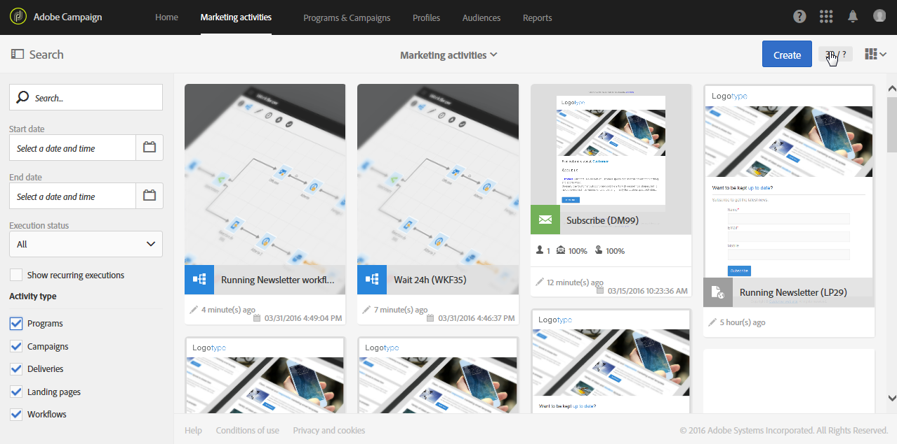
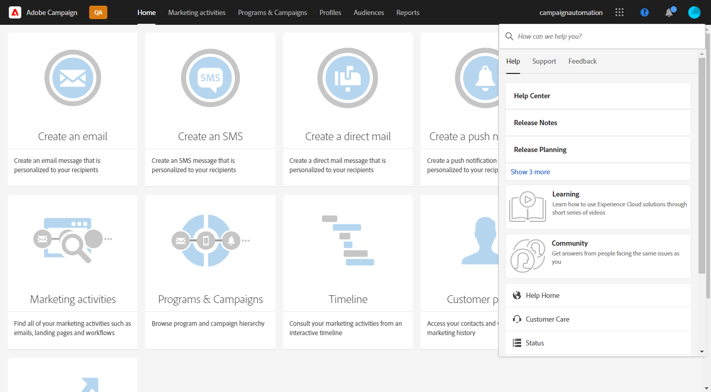
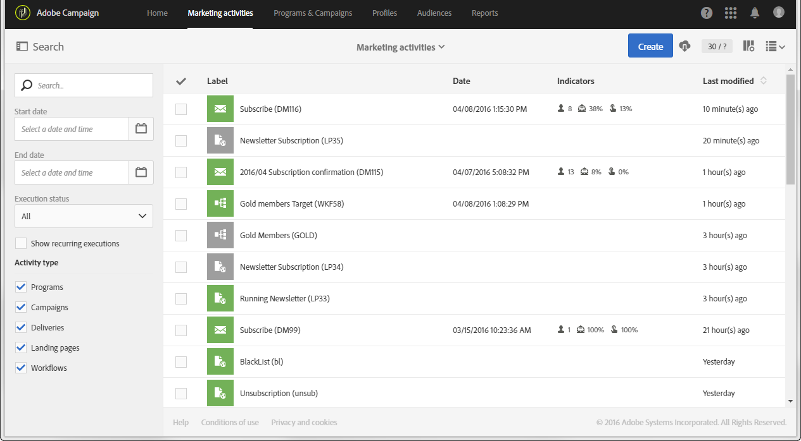
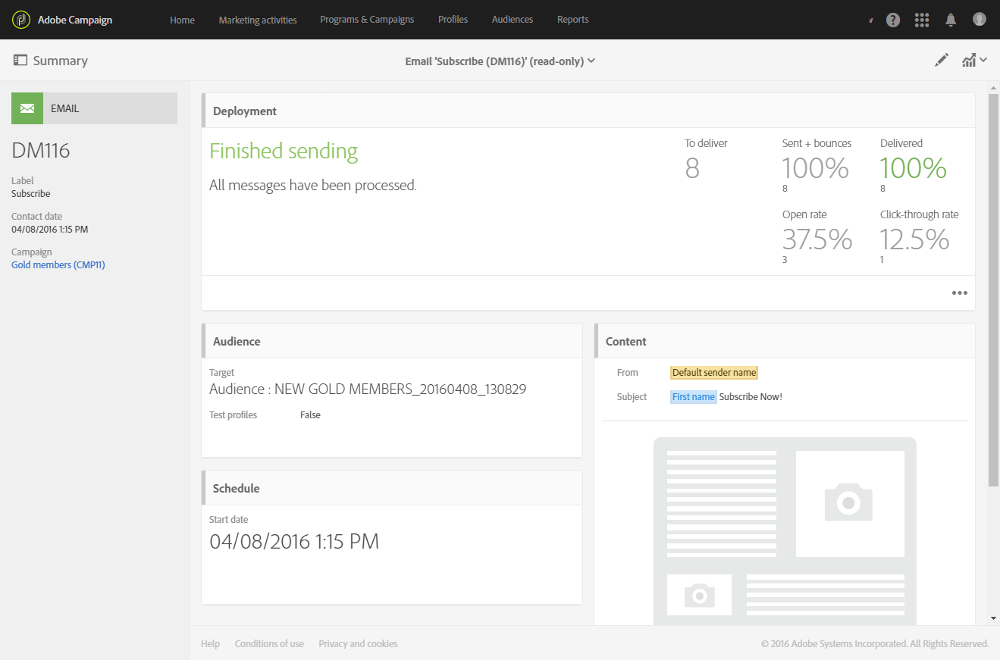
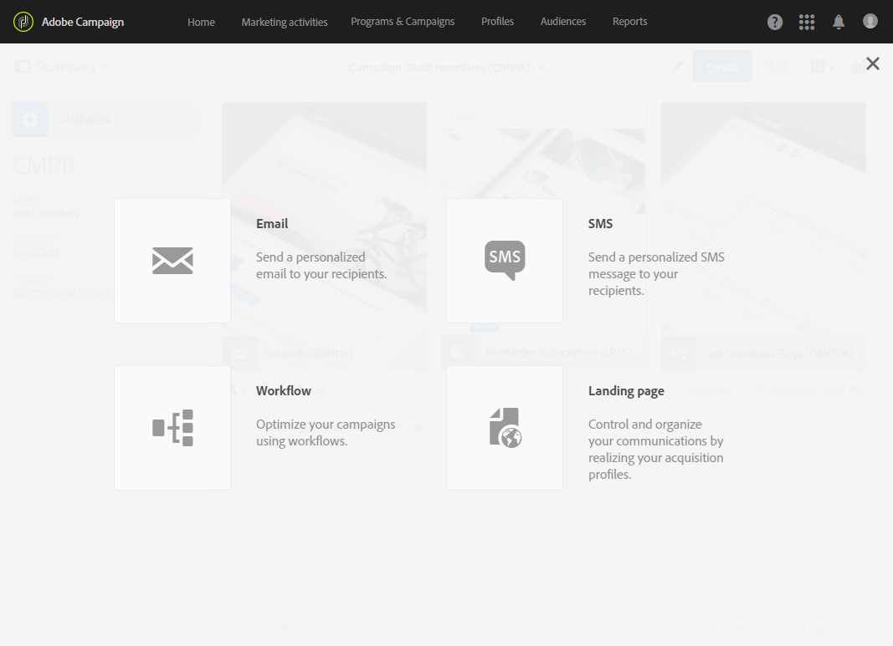
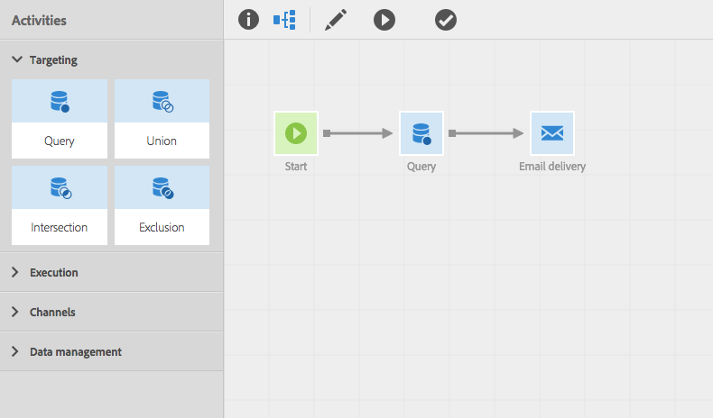
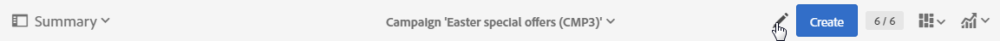

# Interface description{#interface-description}

Adobe Campaign lets you navigate through different menus and screen to manage your campaigns.

All Adobe Campaign screens are made up of the following elements:

* A top bar for navigation
* An advanced menu to access specific functionalities and configurations
* A central zone to work on certain elements
* A lateral panel, according to the context, to filter or search within the elements displayed.

## Home page {#home-page}

The home page is made up of a set of cards that give you quick access to the main Adobe Campaign functionalities. The list of capacities you can see in Campaign home page depends on your permissions and the options configured for your organization.

* The **[!UICONTROL Create an email]** card takes you to the email creation assistant. This assistant lets you choose an email type, select your message recipients and define your content. Refer to the [Creating an email](../../channels/using/creating-an-email.md) section.
* The **[!UICONTROL Create an SMS]** card takes you to the SMS creation assistant. This assistant lets you choose an SMS type, select your message recipients and define your content. Refer to the [Creating an SMS](../../channels/using/creating-an-sms-message.md) section.
* The **[!UICONTROL Create a Direct mail]** card takes you to the direct mail creation assistant. Refer to the [Creating a direct mail](../../channels/using/creating-the-direct-mail.md) section.
* The **[!UICONTROL Create a push notification]** card takes you to the notification creation assistant. This assistant lets you choose a push notification type, select your message recipients and define your content. Refer to the [Creating a push notification](../../channels/using/preparing-and-sending-a-push-notification.md) section.
* The **[!UICONTROL Create an In-App message]** card takes you to the In-App creation assistant. This assistant lets you select the type of In-App message you want to create, define its properties, audience and content. Refer to the [Creating an In-App message](../../channels/using/about-in-app-messaging.md) section.
* The **[!UICONTROL Marketing activities]** card takes you to the complete list of all the activities, programs, and campaigns, particularly emails, SMS, workflows, and landing pages. From here you can then filter the elements by searching by name, date, status or activity type. For more on this, refer to the [Marketing activity list](../../start/using/marketing-activities.md#about-marketing-activities) section.
* The **[!UICONTROL Programs & campaigns]** card takes you to the list of programs in which you can create, and manage your campaigns. Refer to [Program list](../../start/using/programs-and-campaigns.md#about-plans--programs-and-campaigns).
* The **[!UICONTROL Timeline]** card takes you directly to an interactive timeline of your marketing activities, in which you can consult the ongoing programs and their content. Refer to [Timeline](../../start/using/timeline.md).
* The **[!UICONTROL Customer profiles]** card takes you directly to the list of profiles. From here you can consult the events concerning each of the profiles in your list. Refer to [Managing profiles](../../audiences/using/about-profiles.md).
* The **[!UICONTROL Audiences]** card takes you directly to the list of audiences. From here you can access to existing audiences and build new ones. Refer to [Managing audiences](../../audiences/using/about-audiences.md).

## Top bar {#top-bar}

The top bar is visible on every screen and allows you to navigate through Adobe Campaign functionalities as well as access the Adobe profile connected, notifications, Adobe Experience Cloud solutions and Campaign documentation.

The navigation principles are:

* The **[!UICONTROL Adobe Campaign]** logo in the top left-hand corner of the page gives you access to the advanced capabilities and configurations. Menus depend on your profile and permissions.

  The advanced menu is presented in the [Advanced menu](#advanced-menu) section.

* The **[!UICONTROL Home]** link allows you to display the Adobe Campaign home page.
* The **[!UICONTROL Marketing activities]**, **[!UICONTROL Programs & Campaigns]**, **[!UICONTROL Profiles]**, **[!UICONTROL Audiences]** and **[!UICONTROL Reports]** links let you access the views linked to these functionalities.
* The **Solution switcher** icon lets you switch between your organizations or to a different application.
* The **[!UICONTROL Help]** icon is described [below](#help).
* The **Notifications** icon displays the latest alerts or information.
* The **User** icon allows you to display information linked to your profile. Use this icon if you need to **[!UICONTROL Sign out]**.

### Help {#help}

On the top-right corner, the **Help** icon brings Adobe Experience League into the product.

  

Use the **[!UICONTROL Search]** field to find guidance. Search results include documentation and help articles, results from community forums and video content, giving you easier access to more content to help get the most out of the application.

Three tabs help you to find help and assistance:

1. The **[!UICONTROL Help]** tab contains:
    * a quick access to Adobe Campaign Standard documentation with contextual links.
    * a **[!UICONTROL Learning]** link which allows you to access Adobe Campaign courses library.  
    * a **[!UICONTROL Community]** link to access the forum dedicated to your questions on Campaign.
    * a direct access to: Help Center, Customer Care, Experience Cloud product status, Developers connection, Release Notes, Release Planning and the **[!UICONTROL About]** screen.
1. The **[!UICONTROL Support]** tab allows you to open a support case and contact us by phone or Twitter.
1. The **[!UICONTROL Feedback]**  tab makes it easier to report issues or share your ideas.

## Advanced menu {#advanced-menu}

The advanced menu is displayed by clicking the **Adobe Campaign** icon, in the top left corner of each screen. The advanced menu may vary depending your contract and user permissions.

This menu allows you to navigate to specific functionalities and settings.

### Marketing plans {#marketing-plans}

The **[!UICONTROL Marketing plans]** icon gives you access the following functionalities:

* **[!UICONTROL Marketing activities]** - for more on this, refer to the [Marketing activity list](../../start/using/marketing-activities.md#about-marketing-activities) section.
* **[!UICONTROL Programs & Campaigns]** - for more on this, refer to the [Program list](../../start/using/programs-and-campaigns.md#about-plans--programs-and-campaigns) section.
* **[!UICONTROL Timeline]** - for more on this, refer to the [Timeline](../../start/using/timeline.md) section.
* **[!UICONTROL Transactional messages]**, which contains the sub-menus **[!UICONTROL Deliveries]** and **[!UICONTROL Event configuration]** - for more on this, refer to the [Transactional messaging](../../channels/using/getting-started-with-transactional-msg.md) section.

### Profiles &amp; audiences {#profiles-e-audiences}

The **[!UICONTROL Profiles & audiences]** icon gives you access to the following functionalities:

* **[!UICONTROL Profiles]** - for more on this, refer to the [Managing profiles](../../audiences/using/about-profiles.md) section.
* **[!UICONTROL Test profiles]** - for more on this, refer to the [Managing test profiles](../../audiences/using/managing-test-profiles.md) section.
* **[!UICONTROL Audiences]** - for more on this, refer to the [Managing audiences](../../audiences/using/about-audiences.md) section.
* **[!UICONTROL Services]** - for more on this, refer to the [Creating a service](../../audiences/using/creating-a-service.md) section.

### Resources {#resources}

The **[!UICONTROL Resources]** icon gives you access to the following functionalities:

* **[!UICONTROL Templates]**, which contains the sub-menus for each type of template - for more on this, refer to the [Managing templates](../../start/using/marketing-activity-templates.md) section.
* **[!UICONTROL Content blocks]** - for more on this, refer to the [Adding a content block](../../designing/using/personalization.md#adding-a-content-block) section.
* **[!UICONTROL Content templates & fragments]** - for more on this, refer to the [Content template](../../designing/using/using-reusable-content.md#content-templates) section.

### Administration {#administration}

The **[!UICONTROL Administration]** icon gives you access to the advanced functionalities that can only be carried out by functional administrator. For more on this, refer to the [Administration](../../administration/using/get-started-campaign-administration.md) section.

## Central zone {#central-zone}

The central zone of the user interface is a dynamic zone that contains a list of elements or a set of cards for example. It allows you to edit existing elements and create resources.

The content and display format of the central zone can vary:

* A **list** presenting various elements such as programs, campaigns, profiles, etc. These elements can be viewed in **[!UICONTROL Card]** or **[!UICONTROL List]** mode. Use the change mode button to switch from one to the other. Each element displays indicators.

  

  A counter allows you to be aware of the number of elements. If this number exceeds 30 you need to click this counter to get the total number.

* A **dashboard** presenting an overview of all the parameters linked to an activity. This screen includes interactive zones that allow you to separate and configure the different concepts independently.

  

* If several offers are possible when creating an element, a **selection screen** allows you to select the type of element to add (campaigns, deliveries). This selection screen is also offered to access the reports.

  

* For the workflows and the query editor, a **workspace** with a palette is made available for you to design the object.

  You can drag and drop elements from the palette into the workspace to configure the element in question.

  

## Action bar {#action-bar}

According to the screen type displayed, a bar containing actions linked to the screen appears at the top.

This bar not only contains common actions such as search and filtering, but also actions relating to the screen displayed:

* For actions related to **workspace** type screens, refer to either the [Action bar](../../automating/using/workflow-interface.md#action-bar) section for the workflows.
* For actions related to **dashboard** screens, refer to the [Message dashboard](../../channels/using/message-dashboard.md) section for more information.
* For actions related to **list** type screens, refer to the [Customizing lists](../../start/using/customizing-lists.md) section below.
