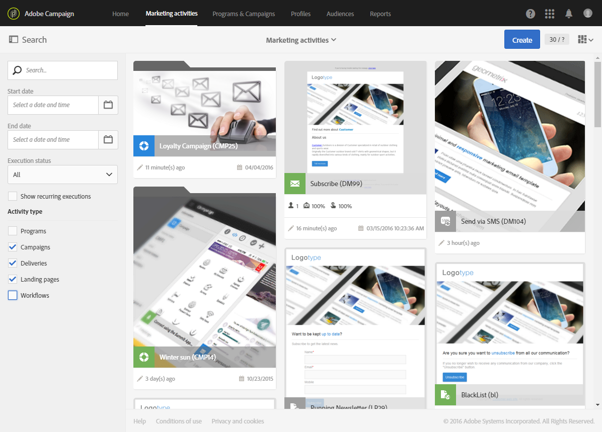
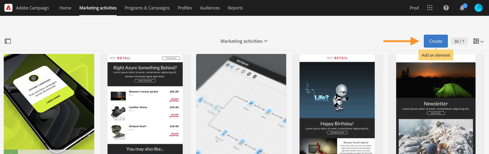
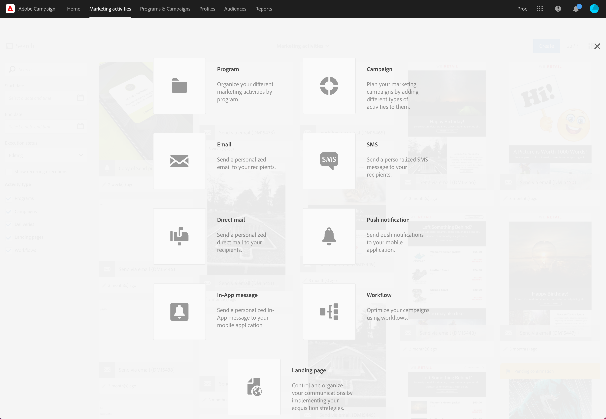

# Marketing activities{#marketing-activities}

Marketing activities

## About marketing activities {#about-marketing-activities}

You can create and manage your marketing activities from the programs and campaigns to which they belong, or via the list of marketing activities.

The marketing activity list centralizes all of the activities, whatever the programs or campaigns in which they were created. Programs, campaigns, deliveries (emails, SMS messages and push notifications), landing pages, and workflows are thus itemized in no particular hierarchical order.

To access the marketing activity list, choose the **Marketing activities** link from the top bar.

>[!NOTE]
>
>The marketing activities can also be accessed by selecting the **Marketing activities** card from the home page.

The **Search** pane allows you to filter elements according to different criteria: name (label and ID), date, status, or activity type. By default, all of the activity types are selected, except programs.

To directly access the content of each activity, choose one of the elements from the list.

The **Create** button can be used to create a new activity. For more on this, refer to the [Creating a marketing activity](../../start/using/marketing-activities.md#creating-a-marketing-activity) section.

## Marketing activity icons and statuses {#marketing-activity-icons-and-statuses}

In the main zone, each type of activity in the list has an icon:

* 

  : Program
* 

  : Campaign
* 

  : Email
* 

  : SMS
* 

  : Push notification
* 

  : Landing page
* 

  : Workflow

Depending on its validity period and status, the color associated with this icon indicates the corresponding activity's execution status.

* Gray: the activity has not yet started - **Editing** status.
* Blue: the activity is in progress - **In progress** status.
* Green: the activity has finished - **Finished** status.
* Yellow: the activity has received a warning - **Warning** status.
* Red: an error has occurred - **Erroneous** status.

## Creating a marketing activity {#creating-a-marketing-activity}

From an existing campaign, you can create different types of messages (**email**, **SMS**, **push notification**, etc.), workflows, and landing pages.

From an existing program, you can create other programs, campaigns, workflows, and landing pages.

>[!NOTE]
>
>Consider creating workflows directly within a campaign. If you create a workflow within a program, you will not be able to move it to a campaign afterwards.

Programs and campaigns are presented in the [Programs and campaigns](../../start/using/programs-and-campaigns.md) section.

1. In the dashboard of a program or a campaign, create a new marketing activity using the **Create** button.

   

1. Select the type of activity that you want to create.

   

According to the context, you can:

* [Create an email](../../channels/using/creating-an-email.md)
* [Create an SMS](../../channels/using/creating-an-sms-message.md)
* [Create a push notification](../../channels/using/creating-and-sending-a-push-notification.md)
* [Create a workflow](../../automating/using/building-a-workflow.md#creating-a-workflow)
* [Create a landing page](../../channels/using/about-landing-pages.md)
* [Create a campaign](../../start/using/programs-and-campaigns.md#creating-a-campaign)
* [Create a program](../../start/using/programs-and-campaigns.md#creating-a-program)

>[!NOTE]
>
>You can also create a marketing activity from the marketing activity list. In this case, you can create any type of activity. You can choose to link the marketing activity to a parent campaign (or to a parent program if you create a program) via the activity's properties.

