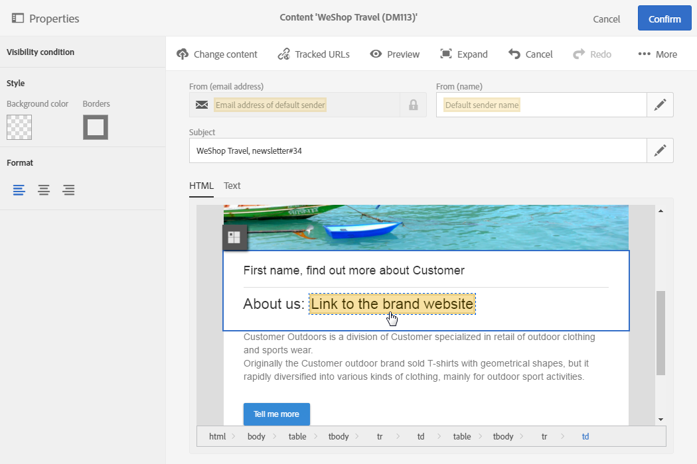

# Personalization{#personalization}

Get your clients' attention and improve your response rate by using content and headers that are personalized according to their profiles, their preferences, and their activity. All of your client information is centralized in Adobe Campaign and you can offer messages containing adapted content, via different channels.

The mode for personalizing messages is detailed in the [Personalizing emails](../../designing/using/inserting-a-personalization-field.md) and [Personalizing SMS messages](../../channels/using/personalizing-sms-messages.md) sections.
