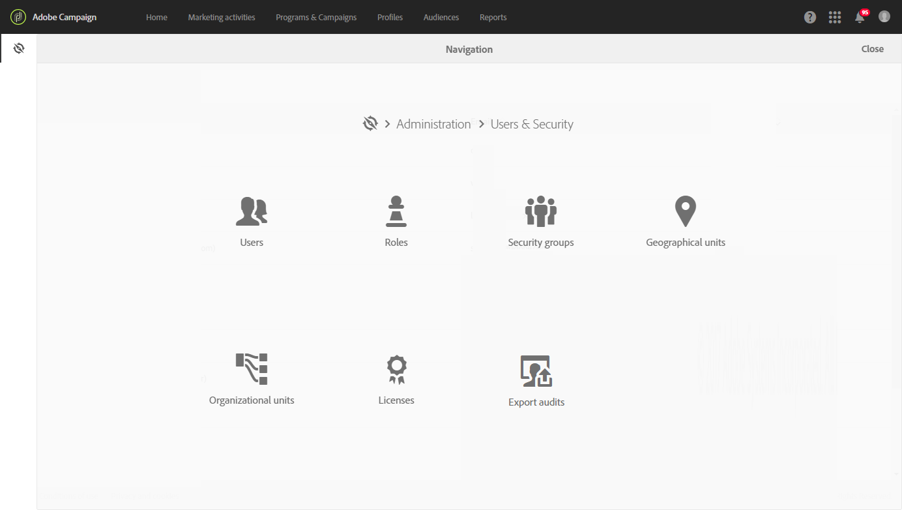

# Privacy management {#privacy-management}

Adobe Campaign offers a set of tools to help you comply with [Privacy regulations](#privacy-management-regulations) (including GDPR, CCPA, PDPA, LGPD).

Here are the five main capabilities offered by Adobe Campaign to ensure GDPR and other privacy regulations readiness:

* **Right to Access**

* **Right to Delete**

For more on this, see [Right to Access and Right to be Forgotten](#right-access-forgotten).

* **Consent management**

* **Data retention**

* **Rights management**

For more on this, see [Consent, Retention and Roles](#consent-retention-roles).

<!--This section presents general information on what Privacy management is and the features provided by Adobe Campaign to manage the [Right to Access and Right to be Forgotten](#right-access-forgotten).

It also contains information on important features to manage Privacy ([consent, data retention and user roles](#consent-retention-roles)), as well as best practices to help you with your Privacy compliance when using Adobe Campaign.-->

## Regulations on Privacy management {#privacy-management-regulations}

Adobe Campaign's capabilities help you comply with the following regulations:

* **GDPR** ([General Data Protection Regulation](https://ec.europa.eu/info/law/law-topic/data-protection/reform/what-does-general-data-protection-regulation-gdpr-govern_en)) is the European Union’s (EU) privacy law that harmonizes and modernizes data protection requirements for EU's countries. Follow the links below to find general information on GDPR:

    * https://www.adobe.com/privacy/general-data-protection-regulation.html
    * https://www.adobe.com/marketing-cloud/campaign/general-data-protection-regulation.html

* **CCPA** ([California Consumer Privacy Act](https://leginfo.legislature.ca.gov/faces/codes_displayText.xhtml?lawCode=CIV&division=3.&title=1.81.5.&part=4.&chapter=&article=)) provides California residents new rights in regards to their personal information and imposes data protection responsibilities on certain entities whom conduct business in California.
* **PDPA** ([Personal Data Protection Act](https://secureprivacy.ai/thailand-pdpa-summary-what-businesses-need-to-know/)) is the new privacy law that harmonizes and modernizes data protection requirements for Thailand. 
* **LGPD** ([Lei Geral de Proteção de Dados](https://iapp.org/media/pdf/resource_center/Brazilian_General_Data_Protection_Law.pdf)) will be effective early 2021 for all companies collecting or processing personal data in Brazil.

All of these regulations apply to Adobe Campaign customers who hold data for Data Subjects residing in the respective regions or countries mentioned above (EU, California, Thailand, Brazil).

>[!NOTE]
>
>For more on personal data and on the different entities that manage data (Data Controller, Data Processor and Data Subject), see [Personal data and Personas](../../start/using/privacy.md#personal-data).

## Right to Access and Right to be Forgotten {#right-access-forgotten}

In order to help you facilitate your Privacy readiness, Adobe Campaign allows you to handle **Access** and **Delete** requests.

* The **Right to Access** is the right for the Data Subject to obtain from the Data Controller confirmation as to whether or not personal data concerning them is being processed, where and for what purpose. The Data Controller shall provide a copy of the personal data, free of charge, in an electronic format.

* Also known as Data Erasure, the **Right to be Forgotten** (delete request) entitles the Data Subject to have the Data Controller erase his/her personal data, cease further dissemination of the data, and potentially have third parties halt processing of the data.

To learn how you can create **Access** and **Delete** requests and how Adobe Campaign processes them, refer to the [implementation steps](../../start/using/privacy-requests.md#about-privacy-requests).

Tutorials on Privacy management in Campaign Standard are also available [here](https://experienceleague.adobe.com/docs/campaign-standard-learn/tutorials/privacy/privacy-overview.html?lang=en#privacy).

>[!NOTE]
>
>For more on personal data and on the different entities that manage data (Data Controller, Data Processor and Data Subject), see [Personal data and Personas](../../start/using/privacy.md#personal-data).

## Consent, Retention and Roles {#consent-retention-roles}

In addition to the most recent **Right to Access** and **Right to be Forgotten** capabilities, Adobe Campaign offers other important features that are essential to Privacy:

* [Consent management](#consent-management): subscription functionality for preference management
* [Data retention](#data-retention): data retention periods on all standard log tables, additional retention periods can be set up with workflows
* [Rights management](#rights-management): data access managed by named right

### Consent management {#consent-management}

Consent signifies agreement by the Data Subject to the processing of personal data relating to a Data Subject. Obtaining any necessary consent for that processing is the responsibility of the Data Controller. While Adobe Campaign may provide some features to help a customer manage consent related to the service, Adobe is not responsible for consent. Customers should work with their own legal departments to determine their own processes and practices for any necessary consent.

The features to help manage some aspects of consent have been core to Adobe Campaign since the beginning. Through the subscription management process, customers can track which recipients have opted-in to which type of subscriptions whether it be newsletters, daily or weekly promotions, or any other type of marketing program.

For more on Consent management, see [About subscriptions](../../audiences/using/about-subscriptions.md) and [Get started with landing pages](../../channels/using/getting-started-with-landing-pages.md).

In addition to the Consent Management tools provided by Adobe Campaign, you have the possibility to track whether a consumer has opted-out for the sale of Personal Information. See [this section](../../start/using/privacy-requests.md#sale-of-personal-information-ccpa).

### Data retention {#data-retention}

Regarding retention, built-in log tables in Campaign have pre-set retention periods on them, generally limiting their data storage to six months or less.

The following are the default retention values for built-in tables. Be aware that the retention configuration is set by Adobe technical administrators during implementation and values may vary for each implementation, based on customer requirements.

* **Consolidated tracking**: 6 months
* **Delivery logs**: 6 months
* **Tracking logs**: 6 months
* **Events**: 1 month
* **Statistics of event processing**: 6 months
* **Archived events**: 6 months
* **Temporary entities**: 7 days
* **Ignored pipeline events**: 1 month
* **Delivery alerts**: 1 month
* **Export audit**: 6 months

And similar to delete, using standard workflow functionality, it is possible to set up retention periods for any custom table.

Reach out to the Adobe consultants or technical administrators to learn more about retention or if you need to set retention for custom tables.

### Rights management {#rights-management}

Adobe Campaign provides you the ability to manage the rights assigned to the various Campaign operators via different pre-built or custom roles.

One benefit is this allows you to manage who within your company can access different types of data. For example, you might have different marketers covering different geos and each marketer can only access data from their geo.

Similarly, this functionality also allows you to configure different capabilities for each user, such as limiting who can send deliveries, or more relevant for Privacy management, who can modify or export data.

For more on access management, see [this section](../../administration/using/about-access-management.md).
