# Managing Privacy requests {#privacy-requests}

For a general presentation on Privacy Management, refer to [this section](../../start/using/privacy-management.md).

This information applies to GDPR, CCPA, PDPA, and LGPD. For more on these regulations, see [this section](../../start/using/privacy-management.md#privacy-management-regulations).

The opt-out for the Sale of Personal Information, which is specific to CCPA, is explained in [this section](#sale-of-personal-information-ccpa).

>[!IMPORTANT]
>
>Starting 19.4, the use of the Campaign API and interface for Access and Delete requests is deprecated. For any GDPR, CCPA, PDPA, or LGPD Access and Delete requests, you need to use the [Privacy Core Service](#create-privacy-request) integration method.

## About Privacy requests {#about-privacy-requests}

In order to help you facilitate your Privacy readiness, Adobe Campaign allows you to handle Access and Delete requests. The **Right to Access** and the **Right to be Forgotten** (delete request) are described in [this section](../../start/using/privacy-management.md#right-access-forgotten).

To perform those requests, you must use the **Privacy Core Service** integration. Privacy requests pushed from the Privacy Core Service to all Experience Cloud solutions are automatically handled by Campaign via a dedicated workflow.

### Prerequisites {#prerequesites}

Adobe Campaign offers Data Controllers tools to create and process Privacy requests for data stored in Adobe Campaign. However, it is the Data Controller's responsibility to handle the relationship with the Data Subject (email, customer care or a web portal).

It is therefore your responsibility as a Data Controller to confirm the identity of the Data Subject making the request and to confirm that the data returned to the requester is about the Data Subject.

>[!NOTE]
>
>For more on personal data and on the different entities that manage data (Data Controller, Data Processor and Data Subject), see [Personal data and Personas](../../start/using/privacy.md#personal-data).

### Namespaces {#namesspaces}

Before creating Privacy requests, you need to define the namespace you will use. The namespace is the key that will be used to identify the Data Subject in the Adobe Campaign database. Out-of-the-box, two namespaces are available: email and mobile phone. If you need a different namespace (a profile custom field, for example), follow these steps.

Also refer to this [tutorial](https://experienceleague.adobe.com/docs/campaign-standard-learn/tutorials/privacy/namespaces-for-privacy-requests.html?lang=en#privacy) on how to create a namespace.

>[!NOTE]
>
>If you use several namespaces, you will need to create one Privacy request per namespace.

1. Click the Adobe Campaign logo in the top left corner, then select **[!UICONTROL Administration]** > **[!UICONTROL Namespaces]**.

    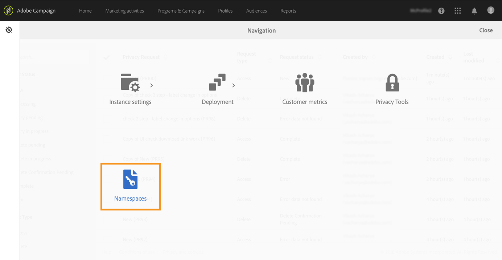

1. In the list of namespaces, click **[!UICONTROL Create]**.

    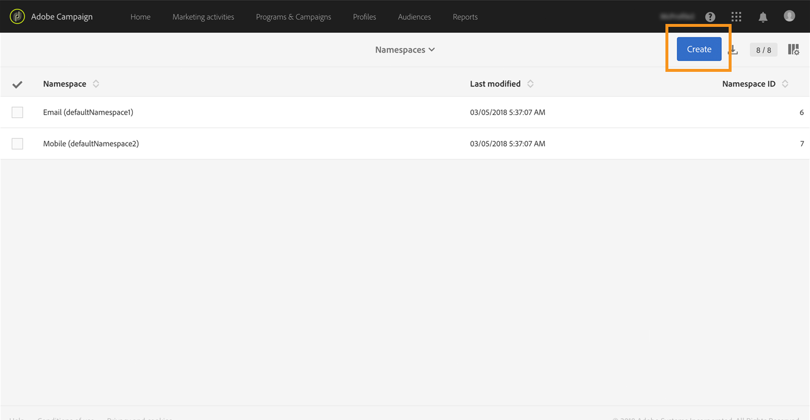

1. Enter a **[!UICONTROL Label]**.

    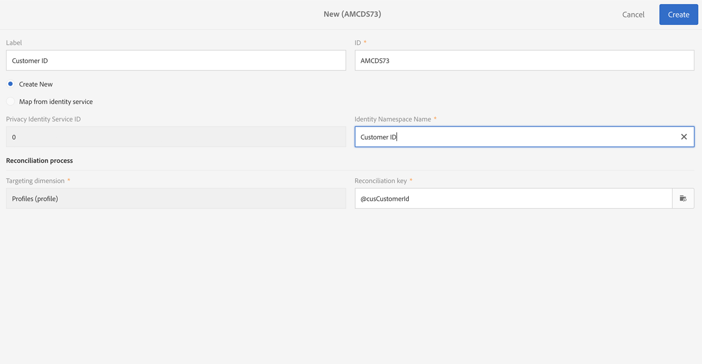

1. If you want to use an existing identity service namespace, choose **[!UICONTROL Map from Identity Namespace Service]** and select a namespace from the **[!UICONTROL Identity Service Namespaces]** list.

    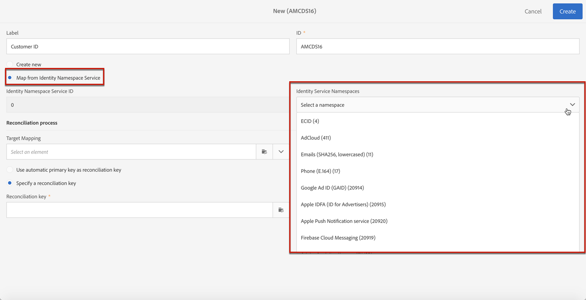

    If you want to create a new namespace in **[!UICONTROL Identity Service]** and map it in Campaign, select **[!UICONTROL Create new]** and enter a name in the **[!UICONTROL Identity namespace name]** field.

    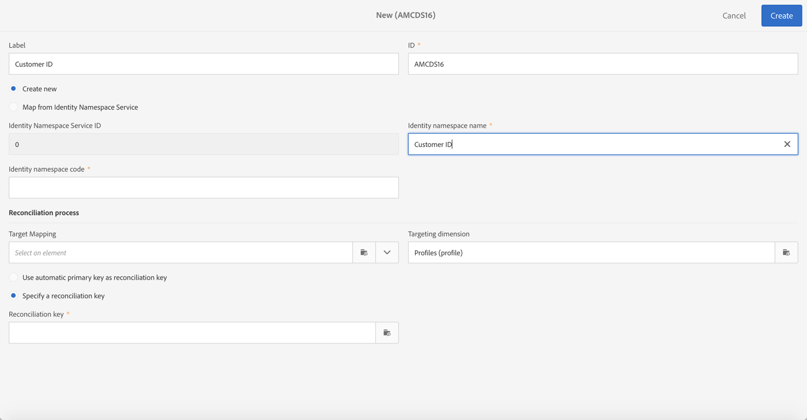

    To learn more about identity namespaces, see the [Experience Platform](https://experienceleague.adobe.com/docs/experience-platform/identity/namespaces.html?lang=en) documentation.

1. One Identity Service Namespace is mapped to one namespace in Campaign. You need to specify how the namespace will be reconciled in Campaign.

    Select a target mapping (**[!UICONTROL Recipients]**, **[!UICONTROL Real-time event]** or **[!UICONTROL Subscriptions to an application]**). If you want to use several target mappings, you need to create one namespace per target mapping.

    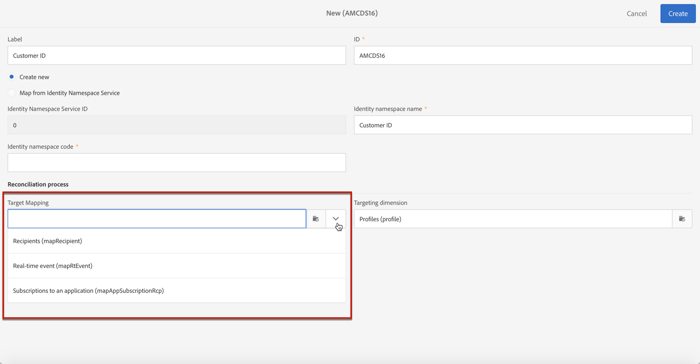

1. Choose the **[!UICONTROL Reconciliation key]**. This is the field that will be used to identify the Data Subject in the Adobe Campaign database.

    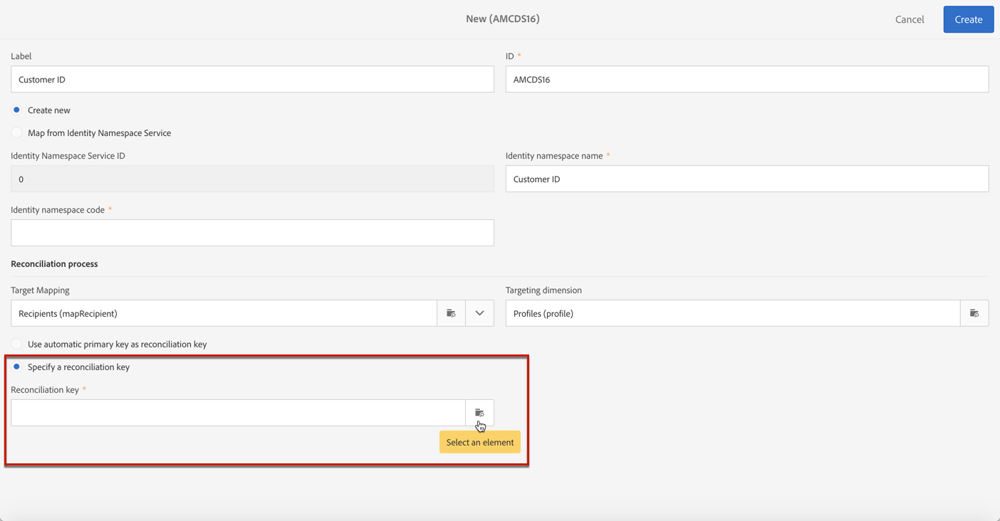

1. Click **[!UICONTROL Create]**. You can now create Privacy requests based on your new namespace. If you use several namespaces, you will need to create one Privacy request per namespace.

### Creating a Privacy request {#create-privacy-request}

>[!IMPORTANT]
>
>The **Privacy Core Service** integration is the method you should use for all Access and Delete requests.
>
>Starting 19.4, the use of the Campaign API and interface for Access and Delete requests is deprecated. Use the Core Privacy Service for any GDPR, CCPA, PDPA, or LGPD Access and Delete requests.

The Privacy Core Service Integration allows you to automate your Privacy requests in a multi-solution context through a single JSON API call. Privacy requests pushed from the Privacy Core Service to all Experience Cloud solutions are automatically handled by Campaign via a dedicated workflow.

Refer to the [Experience Platform Privacy Service](https://experienceleague.adobe.com/docs/experience-platform/privacy/home.html?lang=en) documentation to learn how to create Privacy requests from the Privacy Core Service.

Each Privacy core service job is split into multiple Privacy requests in Campaign based on how many namespaces are being used, one request corresponding to one namespace. Also, one job can be run on multiple instances. Therefore, multiple files are created for one job. For example, if a request has two namespaces and is running on three instances, then a total of six files are sent. One file per namespace and instance.

The pattern for a file name is : `<InstanceName>-<NamespaceId>-<ReconciliationKey>.xml`

* **InstanceName**: Campaign instance name
* **NamespaceId**: Identity Service Namespace ID of the namespace used
* **Reconciliation key**: Encoded reconciliation key

### List of resources {#list-of-resources}

When performing a Delete or Access Privacy request, Adobe Campaign searches all the Data Subject's data based on the **Reconciliation** value in all the resources that have a link to the profiles resource (own type).

Here is the list of out-of-the-box resources that are taken into account when performing Privacy requests:

* Profiles (recipient)
* Profile delivery logs (broadLogRcp)
* Profile tracking logs (trackingLogRcp)
* Delivery logs (Subscriptions to an application) (broadLogAppSubRcp)
* Tracking logs (Subscriptions to an application) (trackingLogAppSubRcp)
* Subscriptions to an application (appSubscriptionRcp)
* Subscription history of profiles (subHistoRcp)
* Profile subscriptions (subscriptionRcp)
* Visitors (visitor)

If you created custom resources that have a link to the profiles resource (own type), they will also be taken into account. For example, if you have a transaction resource linked to the profiles resource and a transaction details resource linked to the transaction resource, they will be both taken into account.

Also refer to [this tutorial](https://experienceleague.adobe.com/docs/campaign-standard-learn/tutorials/privacy/custom-resources-for-privacy-requests.html?lang=en#privacy) on how to modify custom resources.

For this to work, you need to select the **[!UICONTROL Deleting the target record implies deleting records referenced by the link]** option in the custom resource:

1. Click the Adobe Campaign logo in the top left corner, then select **[!UICONTROL Administration]** > **[!UICONTROL Development]** > **[!UICONTROL Custom resources]**.

1. Select a custom resource that has a link to the profiles resource (own type).

1. Click the **[!UICONTROL Links]** section.

1. For each link, click the pencil icon (**[!UICONTROL Edit properties]**).

1. In the **[!UICONTROL Behavior if deleted/duplicated]** section, select the **[!UICONTROL Deleting the target record implies deleting records referenced by the link]** option.

    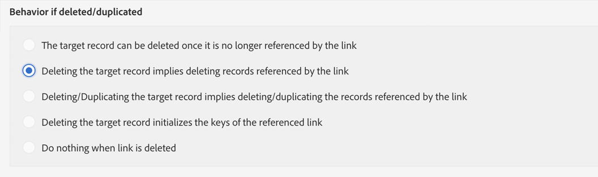

### Privacy request statuses {#privacy-request-statuses}

Here are the different statuses for Privacy requests:

* **[!UICONTROL New]** / **[!UICONTROL Retry pending]**: in progress, the workflow has not processed the request yet.
* **[!UICONTROL Processing]** / **[!UICONTROL Retry in progress]**: the workflow is processing the request.
* **[!UICONTROL Delete pending]**: the workflow has identified all the recipient data to delete.
* **[!UICONTROL Delete in progress]**: the workflow is processing the deletion.
    <!--**[!UICONTROL Delete Confirmation Pending]** (Delete request in 2-steps process mode): the workflow has processed the Access request. Manual confirmation is requested to perform the deletion. The button is available for 15 days.-->
* **[!UICONTROL Complete]**: the processing of the request has finished without an error.
* **[!UICONTROL Error]**: the workflow has encountered an error. The reason is displayed in the list of Privacy requests in the **[!UICONTROL Request status]** column. For example, **[!UICONTROL Error data not found]** means that no recipient data matching the Data Subject's **[!UICONTROL Reconciliation value]** has been found in the database.

<!--### Disabling the 2-step process {#disabling-two-step-process}

The Core Privacy Service does not support the 2-step process.

>[!IMPORTANT]
>
>Before using the Core Privacy Service integration to manage your Privacy requests, you must disable the 2-step process for Delete requests from the Campaign Standard interface.

If this option is not disabled, all Delete requests managed with the Privacy Core Service will remain in pending state and will not complete.

By default, the 2-step process is activated.

To change this mode, click **[!UICONTROL Edit properties]**, in the top right corner of the **[!UICONTROL Privacy Requests]** screen, then uncheck the **[!UICONTROL Activate the 2-step process]** option.

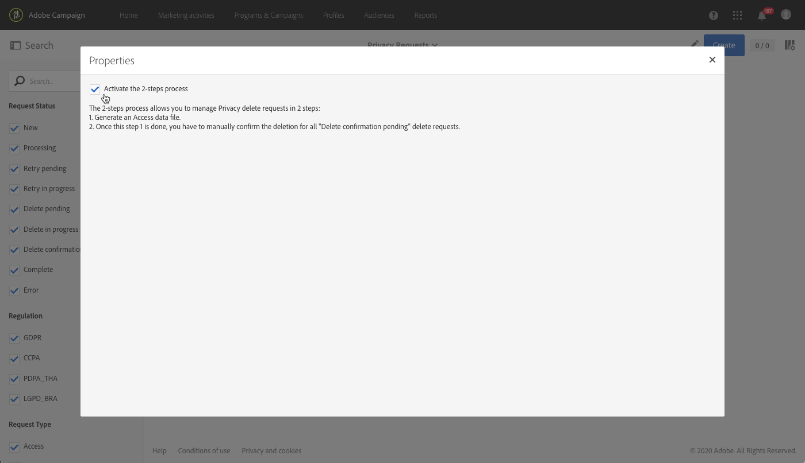-->

## Opt-out for the Sale of Personal Information (CCPA) {#sale-of-personal-information-ccpa}

The **California Consumer Privacy Act** (CCPA) provides California residents new rights in regards to their personal information and imposes data protection responsibilities on certain entities whom conduct business in California.

The configuration and usage of Access and Delete requests are common to both GDPR and CCPA. This section presents the opt-out for the sale of personal data, which is specific to CCPA.

In addition to the [Consent management](../../start/using/privacy-management.md#consent-management) tools provided by Adobe Campaign, you have the possibility to track whether a consumer has opted-out for the Sale of Personal Information.

A consumer decides, through your system, that he/she does not allow his/her personal information from being sold to a third-party. In Adobe Campaign, you will be able to store and track this information.

>[!NOTE]
>
>You can leverage the opt-out for the sale of personal information via the Campaign interface and through the API. You cannot use it through the Privacy Core Service.

>[!IMPORTANT]
>
>It is your responsibility as the Data Controller to receive the Data Subject's request and to keep track of the request dates for CCPA. As a technology provider, we only provide a way to opt-out. For more on your role as a Data Controller, see [Personal data and Personas](../../start/using/privacy.md#personal-data).

### Prerequisite for custom tables {#ccpa-prerequisite}

Starting 19.4, the **[!UICONTROL CCPA Opt-Out]** field is provided out-of-the-box in the Campaign interface and API. By default, the field is available for the standard **[!UICONTROL Profile]** resource.

If you use a custom profile resource, you need to extend the resource and add the field. We recommend that you use a different name than the out-of-the-box field, for example:  **[!UICONTROL Opt-Out for CCPA]** (optoutccpa). When a new field is created, it is automatically supported by the Campaign API.

For more detailed information on how to extend the profile resource, see [this section](../../developing/using/extending-the-profile-resource-with-a-new-field.md).

>[!NOTE]
>
>Modifying resources is a sensitive operation which must be performed by expert users only.

1. Go to **[!UICONTROL Administration]** > **[!UICONTROL Development]** > **[!UICONTROL Custom Resources]**. Click the custom profile resource. For more on extending a resource, see [this section](../../developing/using/creating-or-extending-the-resource.md).

    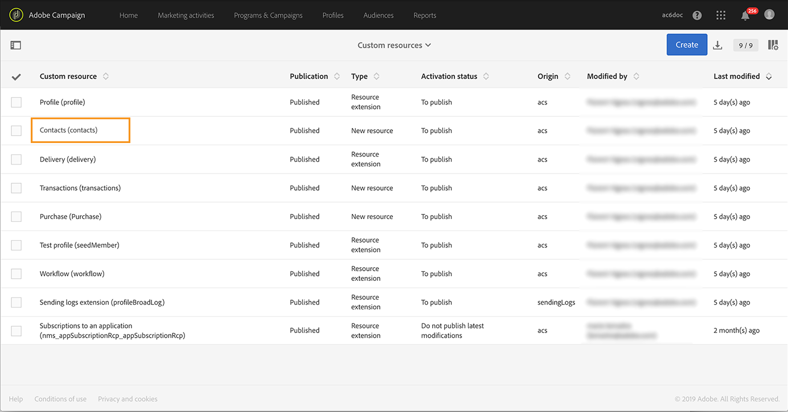

1. Click **[!UICONTROL Add field]** or **[!UICONTROL Create Element]**, add the label, ID and choose the **[!UICONTROL Boolean]** type. For the name, use **Opt-Out for CCPA**. For the ID, use: **optOutCcpa**.

    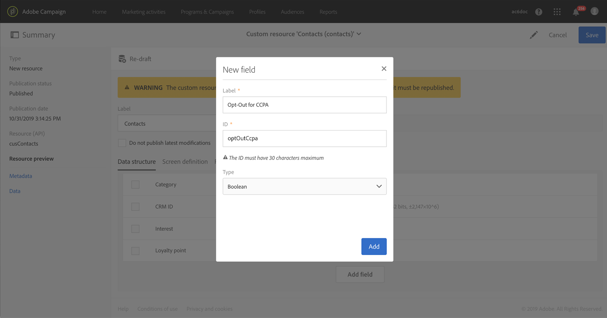

1. In the **[!UICONTROL Screen definition]** tab, under **[!UICONTROL Detail screen configuration]**, add the field and select **[!UICONTROL Input field]**. This will make the field available in the profiles list and details.  For more on configuring the screen definition, see [this section](../../developing/using/configuring-the-screen-definition.md).

    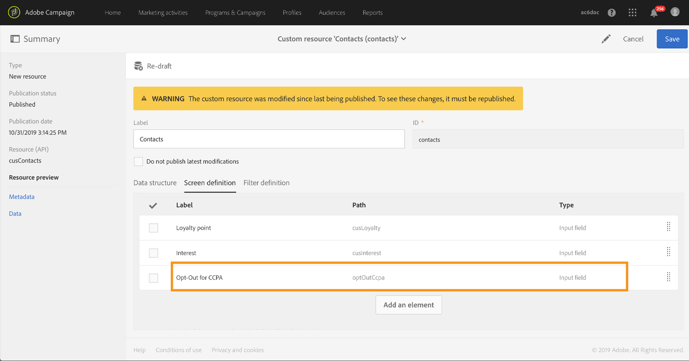

1. Go to **[!UICONTROL Administration]** > **[!UICONTROL Development]** > **[!UICONTROL Publishing]**, prepare the publication and publish the modifications. For more on publishing a resource, see [this section](../../developing/using/updating-the-database-structure.md).

    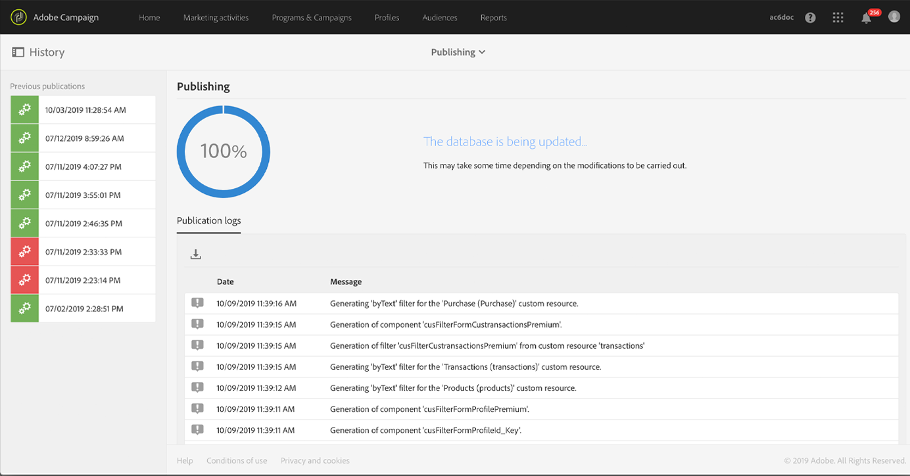

1. Verify that the field is available on a profile’s details. For more on this, see [this section](#usage).

### Usage {#usage}

It is the responsibility of the Data Controller to populate the value of the field and follow the CCPA guidelines and rules concerning data selling.

To populate the values, several methods can be used:

* Using the Campaign’s interface by editing the recipient's details (see below)
* Using the Campaign Privacy API (see the [API documentation](../../api/using/managing-ccpa-opt-out.md))
* Via a data import workflow

You should then ensure that you never sell to any third party the personal information of profiles who have opted-out.

1. In the Campaign's interface, edit a profile to change the opt-out status.

    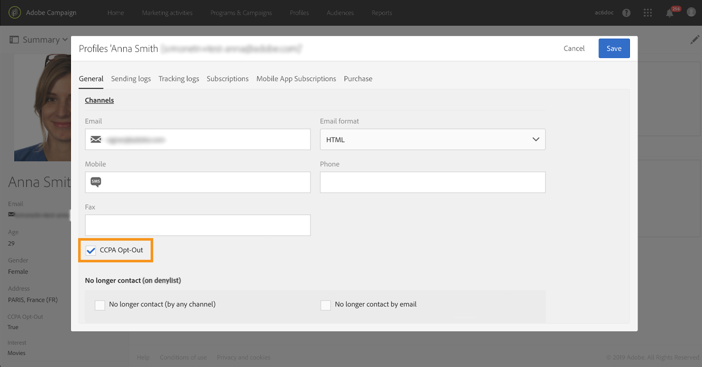

1. When the value of the field is **[!UICONTROL True]**, the information is displayed on the profile's details.

    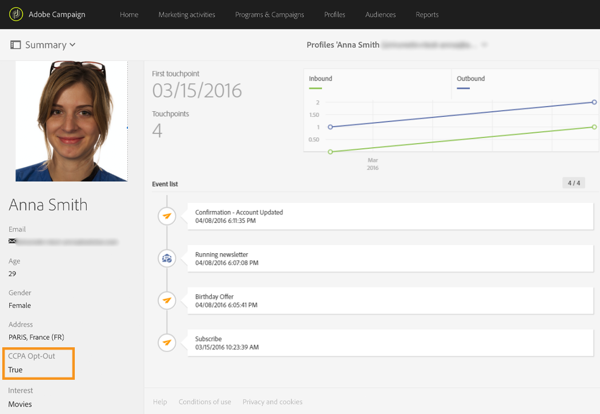

1. You can configure the profiles list to display the op-out column. To learn how to configure lists, see [this section](../../start/using/customizing-lists.md).

    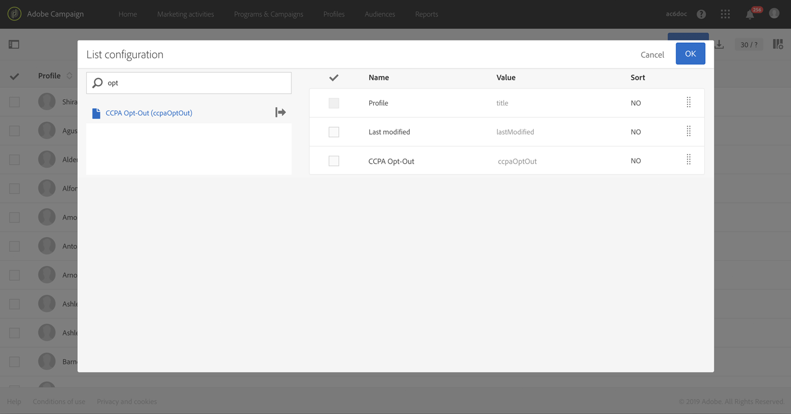

1. You can click the column to sort recipients according to the opt-out information.

    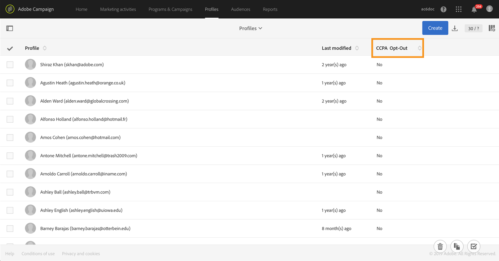
