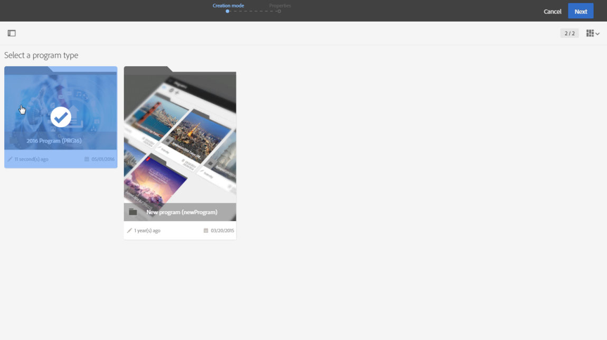
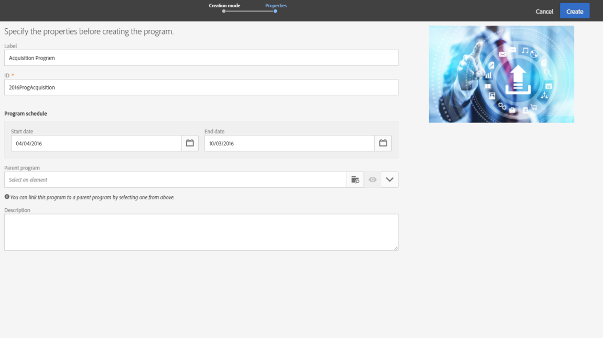
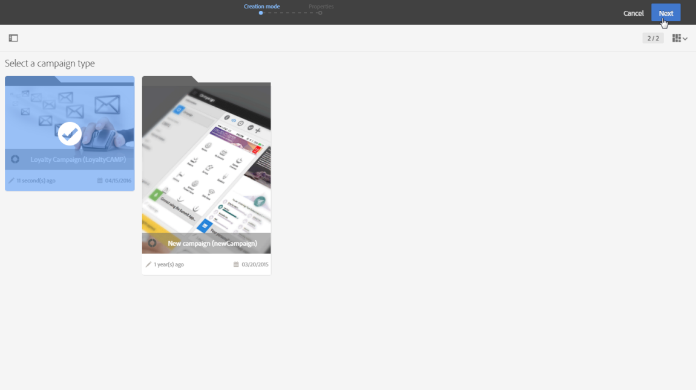
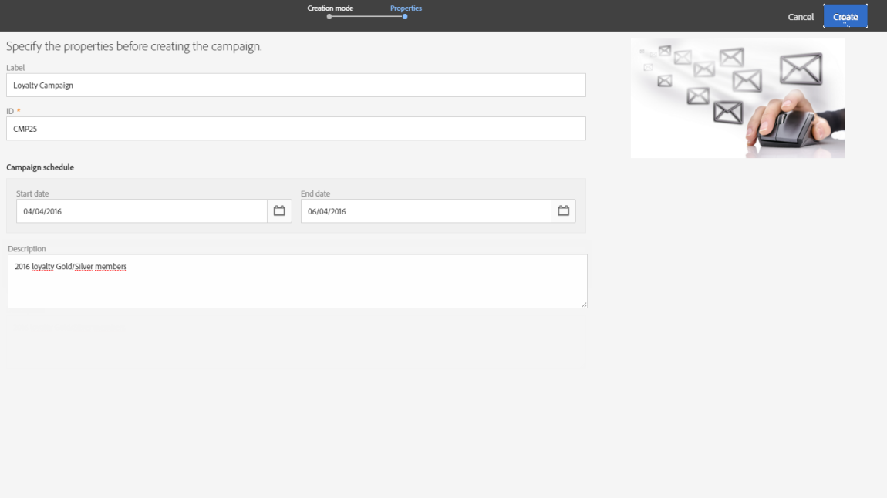
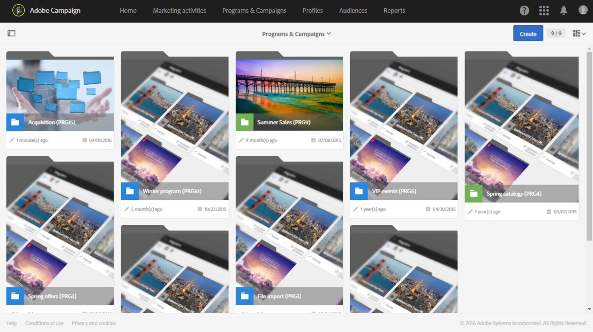

# Programs and campaigns{#programs-and-campaigns}

## About plans, programs and campaigns {#about-plans--programs-and-campaigns}

Adobe Campaign allows you to plan marketing campaigns in which you can create and manage different types of activities: emails, SMS messages, push notifications, workflows, landing pages. These campaigns and their contents can be gathered into programs.

The programs and campaigns allow you to regroup and view the different marketing activities that are linked to them.

* A **program** may contain other programs as well as campaigns, workflows, and landing pages. It appears in the timeline and help you organize your marketing activities: you can separate them by country, by brand, by unit, etc.
* A **campaign** enables you to gather all the marketing activities of your choice under a single entity. A campaign may contain emails, SMS, push notifications, direct mails, workflows, and landing pages.

To better organize your marketing plans, Adobe recommends the following hierarchy: Program > Sub-programs > Campaigns > Workflows > Deliveries.

Reports on programs and campaigns allow you to analyze their impact. For example, you can build reports at the campaign level to aggregate data on all deliveries contained in that campaign.

**Related topics:**

* [Timeline](../../start/using/timeline.md)
* [About dynamic reports](../../reporting/using/about-dynamic-reports.md)

## Creating a program {#creating-a-program}

The program is the first level of organization. It can contain sub-programs, campaigns, workflows or landing pages.

1. From the Adobe Campaign home page, select the **[!UICONTROL Programs & Campaigns]** card.
1. Click on the **[!UICONTROL Create]** button. 
1. In the **[!UICONTROL Creation mode]** screen, select a program type.

   

   The program types available are based on templates defined in the **[!UICONTROL Resources]** > **[!UICONTROL Templates]** > **[!UICONTROL Program templates]** section. For more on this, refer to the [Managing templates](../../start/using/marketing-activity-templates.md) section.

1. In the **[!UICONTROL Properties]** screen, enter the name and ID of the program.

   

1. Select a start and end date to your program. These dates only apply to the program itself.

   You can create your program within a parent program. To do this, select the parent program from the existing programs.

1. Click on **[!UICONTROL Create]** to confirm the creation of the program.

The program is created and displayed. Use the **[!UICONTROL Create]** button to add sub-programs, campaigns, workflows or landing pages.

>[!NOTE]
>
>You can also create a program from the list of marketing activities.

## Creating a campaign {#creating-a-campaign}

In programs and sub-programs, you can add campaigns. Campaigns can contain marketing activities such as emails, SMS, push notifications, workflows, and landing pages.

1. From the Adobe Campaign home page, select the **[!UICONTROL Programs & Campaigns]** card and access a program or sub-program. 
1. Click on the **[!UICONTROL Create]** button and select **[!UICONTROL Campaign]**.
1. In the **[!UICONTROL Creation mode]** screen, select a campaign type.

   

   The campaign types available are based on templates defined in **[!UICONTROL Resources]** > **[!UICONTROL Templates]** > **[!UICONTROL Campaign templates]**. For more on this, refer to the [Managing templates](../../start/using/marketing-activity-templates.md) section.

1. In the **[!UICONTROL Properties]** screen, enter the name and ID of the campaign.
1. Select a start and end date to your campaign. These dates only apply to the campaign itself.

   

1. Click on **[!UICONTROL Create]** to confirm the creation of the campaign.

The campaign is created and displayed. Use the **[!UICONTROL Create]** button to add marketing activities to your campaign.

>[!NOTE]
>
>Depending on your license agreement, you may access only some of these activities.

You can also create a campaign from the marketing activity list. You can choose to link the marketing activity to a parent program or sub-program via the properties window of the campaign.

## Programs and campaigns icons and statuses {#programs-and-campaigns-icons-and-statuses}

Each program and each campaign in the list has a visual symbol and an icon whose color indicates the execution status. This status depends on the validity period of the program or the campaign.

* Gray: the program/campaign has not yet started - **[!UICONTROL Editing]** status.
* Blue: the program/campaign is in progress - **[!UICONTROL In progress]** status.
* Green: the program/campaign has finished - **[!UICONTROL Finished]** status. By default, the current date is automatically shown as the validity start date and the end date is calculated according to the start date (**D+186 days**). You can change these dates in the program or campaign properties.

