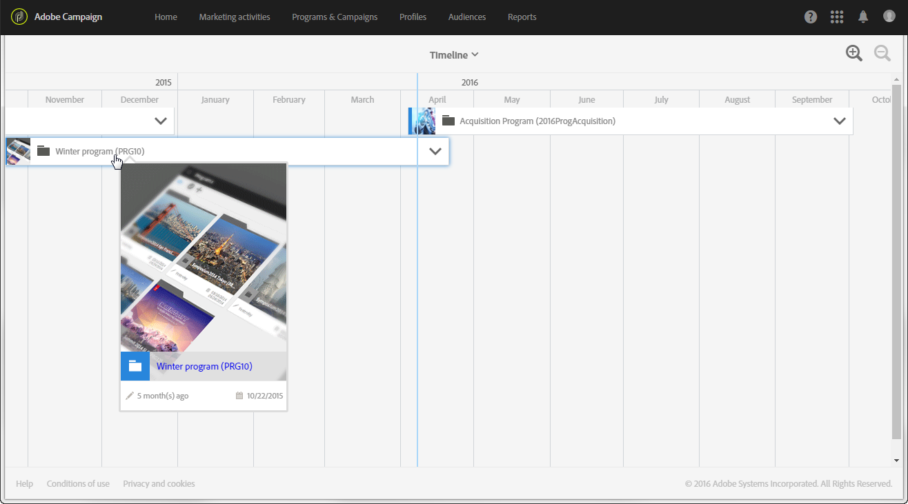
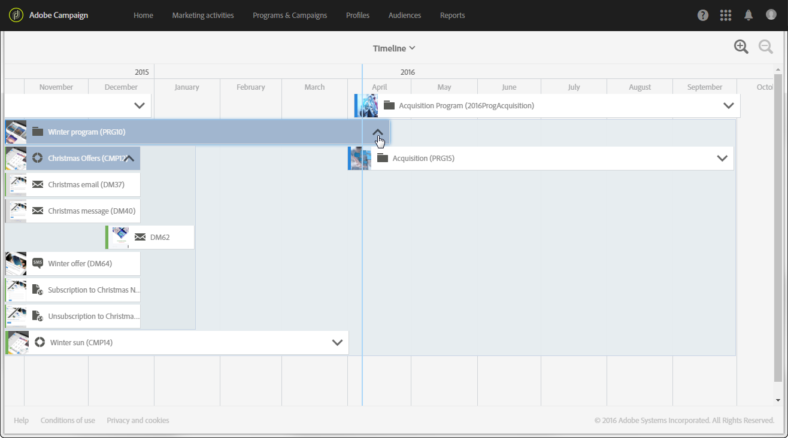
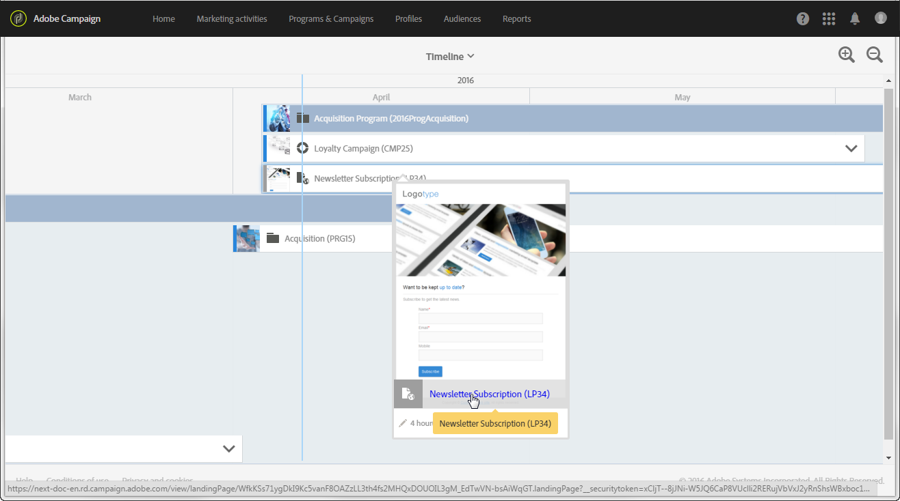

# Timeline{#timeline}

The **[!UICONTROL Timeline]** allows you to visualize programs that are in progress and their content.

To access the timeline, click the corresponding card from the home page.

By default, the timeline only details programs, which are chronologically displayed between the start dates and end dates defined.

Each program is represented by a box containing the corresponding thumbnail and label. Depending on the screen size and the number of elements to display, the label may be replaced by the program ID.

The blue vertical line is a chronological marker to highlight the current date. By default it is found in the middle of the screen. You can scroll right or left within the screen to modify the period displayed.

Use the icons to;

*  reduce the perimeter, or increase the level of detail for a more limited period, until days are displayed
*  increase the perimeter, or display a larger timeframe

Click the arrow on the right of each program name to display the corresponding content. A program can contain sub-programs, campaigns, and landing pages. A campaign is deployed in the same way as a program and can contain emails, SMS and landing pages.

>[!NOTE]
>
>As workflows do not have a particular notion of a date, they do not show up in the timeline.

When the content of a program or a campaign is being displayed, the corresponding box turns blue and the arrow on the right-hand side turns upside down. Re-click the arrow to hide the content.

Each element has an icon that corresponds to its type:

*  Program
*  Campaign
*  Landing page
*  Email
*  SMS
*  Push notification

The colored line on the left border of each box indicates the status of the element concerned.

* When an element has not yet started, the line is gray.
* If an element is in progress, the line is blue.
* As soon as an element has finished, the line turns green.

Click a program or any other element displayed to make the corresponding card appear. Then click on the card to go directly to the content of the element selected and modify it.

Click anywhere else in the screen to make the card disappear.
