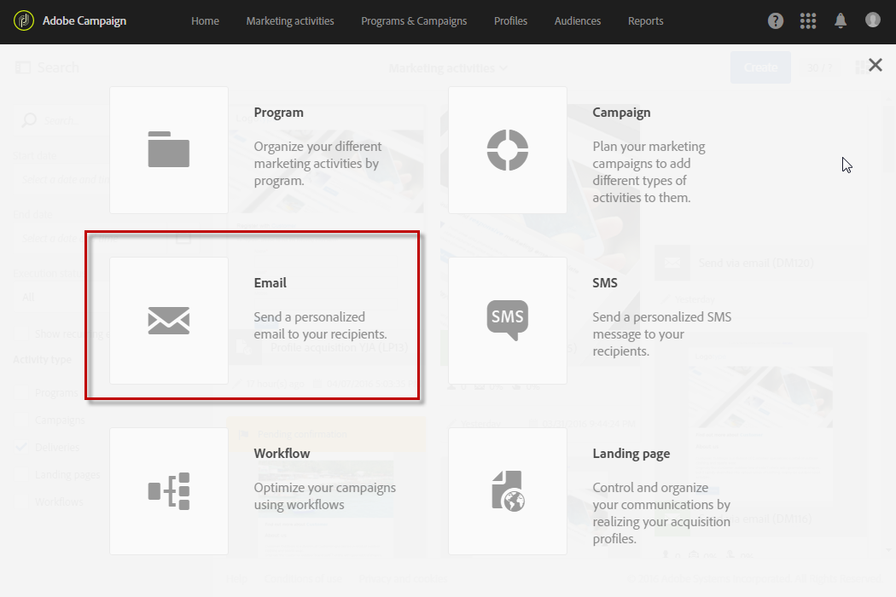
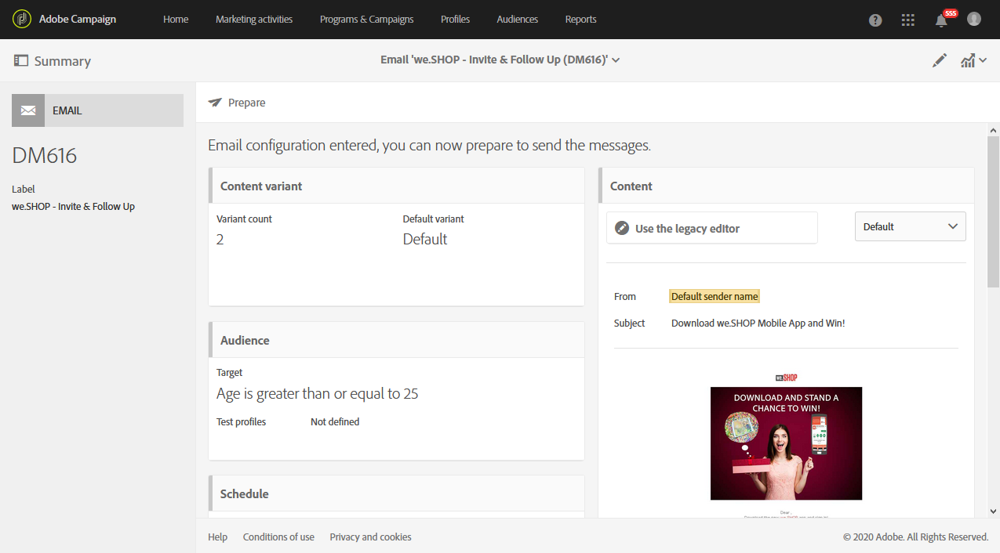

# Using a template{#using-a-template}

Using a template

We are now going to look into how to use the email template created in the earlier section.

>[!NOTE]
>
>Creating a marketing activity based on a template is generally carried out by a standard user type profile.

1. Create a new marketing activity.

   

1. In the first screen in the wizard, select the template that you would like to use.

   

   The marketing activity is pre-configured with the parameters defined in the template.

   

